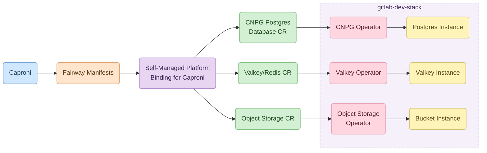
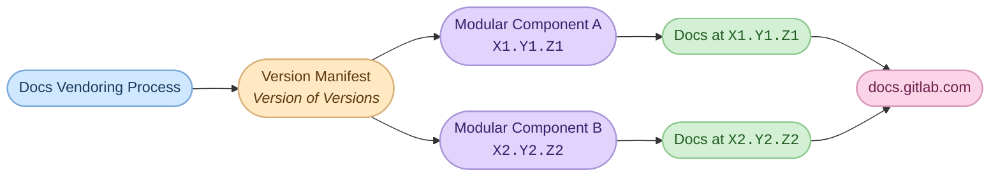
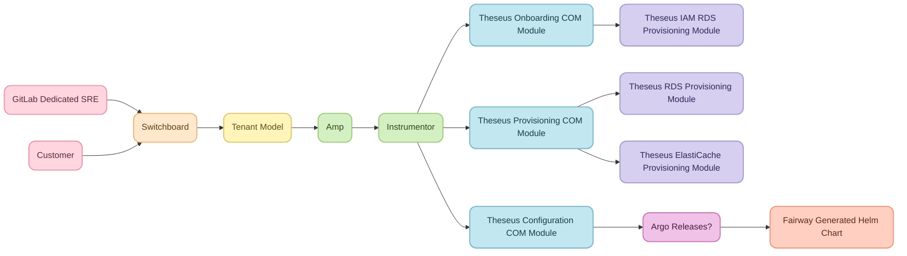

---

title: "Theseus Platform Vision"
description: "GitLab's internal developer platform: the architectural contract for delivering components across GitLab.com, Dedicated, and Self-Managed."
status: proposed
creation-date: "2026-05-06"
authors: [ "@andrewn" ]
coaches: [ ]
dris: [ ]
owning-stage: ""
participating-stages: []
toc_hide: true
---

<!-- Design Documents often contain forward-looking statements -->
<!-- vale gitlab.FutureTense = NO -->



## Reading guide

The document is long,
and different audiences should review different sections.

| If you are…  | Read                                                                                                                                                                                                                                                            |
| ------------ | --------------------------------------------------------------------------------------------------------------------------------------------------------------------------------------------------------------------------------------------------------------- |
| An executive | [Section 0](#0--executive-summary), [Section 1](#1--why-theseus-why-now), [Section 2](#2--what-is-theseus), [Section 7](#7--whats-not-yet-covered), [Section 8](#8--how-we-measure-success) (≈5 pages)                                                          |
| A manager    | [Section 0](#0--executive-summary)–[Section 4](#4--one-platform-many-bindings), skim [Section 5](#5--how-it-works-the-developer-journey), then [Section 6](#6--theseus-for-the-gitlab-deployment-operator)–[Section 9](#9--what-needs-to-ship-next) (≈12 pages) |
| An engineer  | All of it, plus the [appendices](#appendices)                                                                                                                                                                                                                   |

---

## Decisions

Architectural decisions taken in service of this vision are recorded as ADRs in the `decisions/` directory.
Each ADR captures the context, the decision, its consequences, and the alternatives considered.

| ADR                                                              | Title                                                                               | Status   |
| ---------------------------------------------------------------- | ----------------------------------------------------------------------------------- | -------- |
| [001](decisions/001_protobuf_as_preferred_schema_language.md)    | Protobuf as the preferred schema language                                           | Proposed |
| [002](decisions/002_one_interface_many_bindings.md)              | One declarative interface, many Platform Bindings                                   | Proposed |
| [003](decisions/003_enterprise_binding_survives_cell_outages.md) | Enterprise Platform Binding services must survive Cell outages                      | Proposed |
| [004](decisions/004_independent_vs_bundled_releases.md)          | Independent per-component deploys for GitLab.com; bundled releases for Self-Managed | Proposed |
| [005](decisions/005_labkit_go_native_go_library.md)              | LabKit Go remains a native Go library                                               | Proposed |
| [006](decisions/006_lab_bench_assemblies_are_first_class.md)     | Lab Bench assemblies are first-class platform components                            | Proposed |
| [007](decisions/007_prefer_labkit_library_over_assembly.md)      | Prefer LabKit library code over assembly-framework implementations                  | Proposed |

---

## 0 — Executive summary

Theseus is GitLab's internal developer platform:
a single system spanning development through production across every GitLab deployment model, including:
developer workstations, CI, GitLab.com & Cells, GitLab Dedicated, GitLab Dedicated for Government, and Self-Managed.

Some components of Theseus have been developed independently and may have existed for some time:
the Metrics Catalog since 2018, common-ci-tasks CI Components since 2022.
Some components, such as the GitLab Metrics Operator, are still in the proposal stage,
and have yet to be developed.

The Theseus Platform emerges when these components are combined into a single platform.

This vision document is focused on the components that the **Platform Engineering** team will deliver,
and the immediate priority for onboarding the **Artifact Registry**, the first Modular Component.

The wider Theseus initiative is greater than this scope.
Other efforts, notably **Lab Bench** ([Section 2.8](#28-lab-bench-and-the-wider-theseus-initiative)),
are part of the wider Theseus initiative,
and teams may choose to adopt them.

<br>
<small>A high-level diagram mapping out the various components of Theseus.</small>

### Guiding principles

These principles were originally lifted from the _Guiding Principles_ section of the [canonical Theseus design document](https://docs.google.com/document/d/1tOYqFsLQ7axB2ZWQ4mORf9fVzYHNI3yC5j3MPwRk8i4) and have been adapted in the course of writing this vision document.

1. **Paved paths, not gates.**
   Make the right thing the fast thing.
   The platform should accelerate teams.
   Development teams can self-serve on the paved path, and shouldn't be blocked
   on Platform Teams in order to deliver their components into production environments.
2. **One platform for every team. Not every problem.**
   Theseus works everywhere GitLab runs and every product team builds on it.
   It standardises what's shared and repeatable.

   GitLab has a tendency to build a bespoke platform solution
   for each new problem we need to solve as we deliver solutions to Self-Managed.
   Instead, Theseus is a single common platform capable of tackling deployment
   problems across multiple domains,
   so the next new component does not require its own bespoke platform.

3. **Convention over configuration.**
   Services declare what they need, rather than how it's provided.

   Closely related to this is _Defaults over decisions._
   Observability, security, and connectivity should work out of the box,
   and sensible defaults should be applied unless there is a reason not to.
   Guardrails suited to GitLab's policies, architecture, and operational
   practices are part of those defaults, not bolted on after the fact.

   Rather than opting in, teams should have to deliberately opt out of good behaviour.

4. **One platform, everywhere GitLab runs.**
   What runs on a developer workstation runs in CI, GitLab.com, Dedicated, and Self-Managed.
5. **Well-defined interfaces.**
   Each component of Theseus provides a well-defined interface,
   offering strongly typed schema, validation, and documentation.
   Interfaces must evolve while supporting backwards- and forwards- compatibility.
   Interfaces must be machine-readable, where applicable.
6. **Separation of intent from mechanism.** Theseus allows teams to
   define the _What_, the desired state, and leave the _How_,
   the means of achieving that state, to the implementation.
   Different implementations may have different ways of reaching the
   desired state.

### Status (May 2026)

LabKit, `common-template-copier`, `common-ci-tasks`, the Component Ownership Model,
and Runway (for GitLab.com, Cells, and Dedicated) are in production;
Caproni, LabKit v2, the [Release Framework](https://internal.gitlab.com/handbook/engineering/architecture/design-documents/release-platform/), and Fairway are in active development;
the [GitLab Metrics Operator](https://docs.google.com/document/d/1vXBnoqOPREk5j_2YYF9zTwnFgUQKGfhrxC471QgOs8M) is proposed.

---

## 1 — Why Theseus, why now?

### 1.1 The shift from monolith to portfolio

GitLab's infrastructure has shifted from a predictable monolithic Rails application
to an explosion of new components, including
Zoekt, ClickHouse, OpenBao, AI services, NATS, and more.
Infrastructure processes designed for evolutionary change have not kept pace,
and the result is a delivery bottleneck:
features ship to GitLab.com but stall before reaching Dedicated and Self-Managed customers.

[DORA's 2025 _State of AI-Assisted Software Development_ report](https://dora.dev/research/2025/dora-report/)
finds that when platform quality is high, the effect of AI adoption on organisational performance is strongly positive;
when it is low, the effect is negligible.

Theseus is GitLab's investment in the platform on which Act 2 will be built.

### 1.2 Theseus enables modular components

Theseus is the cornerstone of the [Modular Features](https://docs.google.com/document/d/1-7ypeuacczPMYxP8ZLPxXhvIxYkBvEfZ_OgypY098Aw/edit)
initiative.

Modular Components enable GitLab to shift development left,
encouraging ownership by application development teams,
and avoiding the current delivery bottleneck that GitLab is experiencing.

Theseus allows teams to rapidly iterate without being blocked by Infrastructure,
and allows Infrastructure to focus on the platform,
instead of babysitting other teams' features.

---

## 2 — What is Theseus

<br>
<small>Theseus Stack Tradeoffs.</small>

### 2.1 The definition

Theseus is GitLab's effort to develop an Internal Developer Platform,
enabling true modern DevOps, and encouraging team ownership of their components.

Theseus is the combination of several existing tools,
and some newly proposed initiatives that together create a single system,
spanning development through production across every GitLab target platform.

The full set of components is maintained as a single source of truth in [Section 2.7 Component inventory](#27-component-inventory).

### 2.2 The architectural contract

> Theseus enforces one architectural boundary throughout:
> the separation of what software needs from how infrastructure provides it.
>
> _Developers declare requirements._
> A service says "I need a PostgreSQL compatible database, a key-value store, and object storage."
> It never specifies which instance, where it runs, or how to connect.
>
> _Operators satisfy requirements._
> They define the infrastructure that exists and how services bind to it.
> Whether six services share one database or each gets its own is an operator decision,
> not an application decision.

Theseus defines the contractual interface between stream-aligned Application Development teams
building modular features, and the Platform Engineering team.

Application Development teams define the "_What_":

- _what_ needs to be built
- _what_ needs to be observed
- _what_ needs to be executed at runtime
- _what_ dependencies the application has

The Platform Engineering team will define the "_How_":

- _how_ to build the artifacts
- _how_ to observe the application
- _how_ to execute the code at runtime
- _how_ to satisfy the dependencies

The "_What_" is defined by a stable, well-defined, documented interface as its contract.
The "_How_" is an implementation detail, not defined by the contract.
Different GitLab Platforms, GitLab.com vs. Cells, for instance, may have different implementations
of the "_How_", and these can change at any time,
provided the contract defined in the interface is satisfied.

For example, an Application Development team may declare that what their application needs is a Postgres database.
Different Platform Bindings may implement this differently:

- On GitLab.com, using a Google CloudSQL instance.
- On Dedicated, using an AWS RDS instance.
- On Caproni, using an in-cluster Postgres instance provisioned using a Postgres Operator.

The contract does not define the implementation, and the Platform Engineering team makes no
guarantees about the type of Postgres instance the application will be provided,
only that one will be provided. The same approach will be followed for other supported dependencies,
such as ClickHouse, ValKey, etc.

Besides dependencies, Theseus follows the same approach in other domains:
for example, the GitLab Metrics Operator provides module developers with a way to
describe _what_ the service levels for a module are,
_what_ the bottlenecks for saturation are, and the GitLab Metrics Operator will
define _how_ this is done, using Prometheus Recording Rules,
Prometheus Alerts, Tamland for Capacity Planning, etc.

### 2.3 What is an interface?

The previous section described Theseus as the _contractual interface_
between Application Development teams and Platform Engineering.
This section pins down what we mean by "interface" in that sentence.

In Theseus, an **interface** is a stable, typed, versioned contract
between a _producer_ and a _consumer_.
The producer cannot dictate consumer behaviour,
and the consumer cannot depend on producer internals.

In most (but not all) cases, the consumer is the Modular Component,
and the producer is the Platform.

For an interface to do this job, it must have a specific set of properties:

- **Strongly typed and schema-defined.**
  The shape of the contract is explicit and checkable,
  not implicit in code or documentation.
- **Machine-readable, where applicable.**
  For schema-defined contracts, the schema is the source from which
  downstream artifacts — validation, language bindings, JSON-Schema,
  generated documentation — are derived, not hand-written alongside.
- **Semver-versioned.**
  Each interface is a versioned contract, so producers and consumers
  can evolve independently within a major version.
- **Evolvable with compatibility guarantees.**
  Additive changes are the default;
  breaking changes require a major-version bump;
  retired surface goes through a deprecation path.
  Backwards and forwards compatibility within a major version
  are part of the contract, not a courtesy.
- **Validation and documentation are part of the interface.**
  They are not artifacts that sit alongside the contract
  and drift out of sync.

The properties above describe operational hygiene.
They are necessary but not sufficient;
a contract that is typed, versioned, and machine-readable
can still be a badly-designed abstraction.

The discipline of good interface design, in the sense Theseus uses the term,
is set out most concisely in John Ousterhout's
[_A Philosophy of Software Design_](https://web.stanford.edu/~ouster/cgi-bin/aposd.php).

Three of his principles are important in the context of Theseus:

- **Deep, not shallow.**
  A good interface is _simple relative to the implementation behind it_.
  A `FairwayManifest` is a few dozen lines of YAML;
  the platform binding that satisfies it provisions databases, secrets,
  observability, networking, and runtime.
- **Information hiding.**
  The interface conceals design decisions from its consumer.
  Whether a Postgres dependency is satisfied by CloudSQL on GitLab.com,
  RDS on Dedicated, or an in-cluster operator on Caproni
  is not part of the contract.
  The consumer cannot depend on those decisions;
  the producer is free to change them.
- **Pull complexity downwards.**
  When complexity is unavoidable,
  the platform absorbs it rather than pushing it onto every component.
  Observability defaults, secrets-handling plumbing, multi-target packaging —
  these are problems Theseus solves once,
  so the next component team does not.

Interfaces should be evaluated against Ousterhout's test:
_is the interface simpler than the implementation it conceals?_
If not, it may be worth redesigning.

#### 2.3.1 Interfaces in Theseus take several forms

Interfaces are not only declarative schemas.
Across Theseus, the same approach applies to different
types of contract:

- **Declarative manifests** —
  what a component states it needs, consumed by a platform binding.
  A good example is the `FairwayManifest`
  ([Section 4.2](#42-the-single-declarative-interface)).
- **Configuration schemas** —
  what a system is allowed to be, consumed by the engine that realises it.
  A good example is the **[Tenant Model Schema](https://gitlab.com/gitlab-com/gl-infra/gitlab-dedicated/tenant-model-schema/)** in GitLab Dedicated,
  described below.
- **Application Programming Interfaces (APIs)** —
  the typed surface a library exposes to its callers.
  For example, the API offered by
  [LabKit](/handbook/engineering/infrastructure-platforms/developer-experience/labkit/)
  to Modular Components:
  a stable, versioned standard-library surface for logging, metrics, tracing,
  configuration, and cryptography.
- **Command Line Interfaces (CLIs)** —
  the command surface a GitLab Deployment Operator or developer invokes.
  A good example is the [Theseus CLI](https://gitlab.com/gitlab-org/theseus/):
  its commands, flags, exit codes, and output formats are a contract
  that scripts, CI jobs, and operators rely on.
  CLIs must be versioned and carry compatibility guarantees
  on the same terms as any other interface.

Each of these examples uses different tooling to enforce the contract:

- Protobuf for `FairwayManifest`
- JSON Schema for the Tenant Model
- Go module semver plus static typing for LabKit
- The CLI's own release versioning for `theseus`

#### 2.3.2 Preferred technology: Protobuf

For schema-defined contracts,
**Protobuf is Theseus's preferred schema language**,
used via LabKit's `.proto`-schema configuration contracts
(Principle 6, [Section 3.2](#32-platform-as-a-product-commitments)).
Validation rules are expressed inline on the proto definitions
using [protovalidate](https://protovalidate.com) annotations,
following the
[LabKit Configuration design doc](/handbook/engineering/architecture/design-documents/labkit_configuration/),
so the schema and its validation rules are co-located and cannot diverge.

**Other technologies are acceptable, provided they meet the properties above.**
The Tenant Model Schema illustrates this directly:

- It is a versioned **JSON Schema**, not Protobuf,
  and it serves exactly the role this section describes —
  the contract that defines what a Dedicated tenant is allowed to be.
- **Switchboard** owns and stores tenant model state,
  and lets Switchboard users (customers, and Environment Automation engineers)
  edit or stage patches against it.
- **Instrumentor** takes a validated tenant model
  and turns it into actual infrastructure
  and platform configuration (Terraform, Ansible, Helm, Kubernetes).
- Versioning is operationally meaningful:
  the `$schema` is not freely editable in Switchboard —
  it is selected from the Instrumentor version via a mapping file
  (treated as the single source of truth),
  so the contract is tied to the Instrumentor release lineage.
  A newer schema cannot be used against an older Instrumentor branch.

For the rest of this document,
when we say "the interface" we mean a contract of the kind described here —
a declarative manifest, a configuration schema, an API, or a CLI —
most often expressed in Protobuf,
but always with the properties above.

### 2.4 What Theseus is NOT

**Not a one-size-fits-all spec.**
Where teams genuinely need a capability the platform doesn't yet express,
two paths are open:

1. **Extend the platform,** when the capability is likely to be useful to other component teams too.
   One route is for the requesting team to contribute the change to Theseus directly —
   after which the appropriate Theseus team takes over ongoing support.
   Adding the capability to Theseus means the next team that needs it inherits the work,
   and the platform's defaults absorb a class of problem rather than each team re-solving it.
2. **Build it themselves and ship it as part of the module,**
   when the capability is specific enough that a shared abstraction wouldn't pay back.
   The base interface on which Modular Components are expressed is the Kubernetes API,
   so leveraging Kubernetes features directly is always a legitimate option —
   the platform isn't a cage.

The second path has trade-offs:
a team that builds a capability outside the platform is responsible for designing, operating, and supporting it,
with whatever specialist expertise that requires.
The Component Ownership Model ([Section 2.5](#25-theseus-vs-the-component-ownership-model))
is the lower-level route teams take when they go this way, although it only supports SAAS deployments.

Theseus is a high-level, low-risk paved road, building on the Kubernetes API.
COM is a low-level, high-risk alternative, building on Cloud-Provider SDKs.

**Not a replacement for Kubernetes knowledge.**
While teams building on Theseus need to understand the Kubernetes abstractions that affect service behaviour,
they do not need to author Helm charts from scratch or be Kubernetes API experts.
By developing locally in Caproni, against Kubernetes APIs, developers should acquire
the necessary Kubernetes experience.
Theseus encodes the operational practices and guardrails that turn Kubernetes primitives into a working production system.

**Not a substitute for Omnibus.**
Theseus primarily targets the Cloud Native distribution path, although some components,
such as TUBE and the Release Framework, are common to Cloud Native and Omnibus.
Self-Managed Foundation customers running Omnibus on a VM continue on the legacy path
defined by the [Self-Managed Segmentation blueprint](/handbook/engineering/architecture/design-documents/selfmanaged_segmentation/).

Theseus and Omnibus are not in conflict;
they serve different segments of the customer base.

**Not "every problem solved."**
Theseus is an iterative project: capabilities will be added as teams need them
and only after they have been reviewed against the platform's principles,
aligned with the contract and documented.

Different components of Theseus are owned by different teams,
and will evolve at different speeds.
Over time, capabilities — and the platform itself —
could evolve to the point where none of the original components exist.

### 2.5 Theseus vs the Component Ownership Model

An analogy to compare Theseus and COM:
**Theseus is to GitLab's platform what user space is to Linux. The Component Ownership Model is to GitLab's platform what kernel space is to Linux.**

In Linux, kernel-land is powerful and unrestricted:
you can do anything the hardware allows,
but the cost is complexity, deep required expertise, and the responsibility that comes with both.
User-space is more restrictive and more guardrailed —
there are things you cannot do directly —
but it is dramatically easier to write, debug, and maintain,
and much harder to break catastrophically.
Most application developers stay in user-space deliberately,
and reach into the kernel only through a small, stable interface.

Theseus and COM divide GitLab's platform along the same line.

- **Theseus is user-space.**
  Application developer teams declare what their service needs
  and let the platform satisfy those needs across every environment.
  Theseus offers paved paths, defaults, and guardrails.
  It is restrictive on purpose:
  a service cannot reach below the contract,
  and most of the time it does not need to.
- **COM is kernel-land.**
  The Component Ownership Model gives teams direct ownership of infrastructure changes their components depend on for GitLab.com and Dedicated,
  but cannot be used for Self-Managed deployment scenarios.
  There is more flexibility in choosing COM,
  and proportionally more expertise required, more on-call risk, and more responsibility for the consequences.

**Who uses what.**
Where possible, application developer teams should stay in Theseus.
The point of the platform is that they should not need to think
about cloud-provider control-plane APIs, Kubernetes operators, or Terraform-module conventions
to ship a feature.
Many of the **Theseus Platform Bindings** will be implemented in COM.
But those bindings are owned by teams within Platform Engineering, not by application teams.

**Where they meet.**
The Theseus contract is the stable interface between the two layers.
Application teams develop against the contract.
Platform Engineering implements the contract by maintaining the platform bindings that satisfy it.

**Maturity, today (May 2026).**
COM is the most operationally complete part of GitLab's platform infrastructure today,
and the most contested.
The promise-vs-reality gap is documented in [Section 7.3](#73-open-tensions).

For the purposes of this section, the relationship is:
Theseus is the long-term direction;
COM is a lower layer that today does important work that the contract has yet to define and implement.

### 2.6 Fords not Rolls-Royces

<br>
<small>1920s-era production lines of Ford Model-Ts vs. Rolls-Royce Phantoms.</small>

In the 1920s, the automobile industry underwent a major revolution.
Cars like the Rolls-Royce Phantom were built by skilled craftsmen.
The chassis featured meticulous machining and finishing
on parts that would never be seen by anyone.
These craftsmen worked on each car over an extended period of the build.
Each car could be highly customised to the requirements of the customer.
The efficiency rate of the factories was in the order of about 1-2 cars
per 10 workers per year.
The vehicles cost between $12,000 and $18,000 or more each.
Once rolled out, the vehicle required a trained chauffeur to operate and maintain it,
with service intervals as short as 500 miles.
Henry Ford's revolutionary moving assembly line, introduced in 1913
and perfected through the 1920s, took a completely different approach to building the Model-T,
focusing on standardisation above all,
speed of manufacture,
specialist roles at scale,
and limited customisation.
The efficiency of the factory was orders of magnitude greater than that of bespoke
manufacturing: around 20 cars per worker per year.
The Model-T required no dedicated operator: the owner was the intended driver,
and they could self-diagnose and even fix problems themselves.
While the cars were far from perfect, they were cheap to build, easy to diagnose,
and easy to fix.

Theseus is GitLab's plan to move from bespoke deployments for each new component to
a moving assembly line.

However, in order to get there, we need to resist the common antipattern that prevents us from
delivering on the goal of Theseus as a platform-as-a-product.
The argument always sounds reasonable on its merits:
every new component that comes along _urgently_ needs to be delivered _ASAP_!
The time needed to build the assembly line needs to be pushed back,
just a little, until the current urgent project is completed,
possibly after the next quarter.
Each exception is understandable, given the importance and urgency of the particular project at hand.

The reality is that the platform team is saturated with these projects: too busy helping
deliver bespoke solutions for each customer to be able to focus on automating
the production line, which would ultimately lead to a far greater throughput for
all teams.

Having said that, teams cannot be expected to wait for platform engineering to focus exclusively on building the factory ahead of their own deliverables.

How do we solve this? By carefully ensuring that the majority of the "bespoke" effort
that we deliver for each team can also be fitted into the Theseus platform.

For example, if the component has observability requirements which have not yet
been implemented in Theseus, the priority should be to deliver these via LabKit.
This approach is not always possible, and until the platform is complete, some
creative solutions will be required.
For example, as we migrate from Runway on Cloud Run to
Fairway on Kubernetes, components may need to support both as a temporary stop-gap.

This transitional period, as we build the platform, will be complicated,
and will require extended engagement from experts who can find ways to make each engagement benefit both the immediate need and the long-term platform strategy.

Each engagement should make meaningful progress towards completing the platform.

**A footnote to the analogy:**

Ford did not wait until the assembly line was finished before building Model-Ts.

The Model T launched in 1908 at the Piquette Avenue plant,
built by small teams of skilled workers moving around stationary vehicles.
This was craft production, not yet mass production.
The moving assembly line emerged at Highland Park five years later, in 1913,
through years of incremental experimentation.
River Rouge took it further in the 1920s, with full vertical integration.

Production of the car never stopped while the assembly line was being built.
The factory and the product were developed in parallel,
each iteration of the production system absorbing learnings from the cars rolling off the previous one.
The assembly line was the _outcome_ of iterating against a real production workload,
not a precondition for starting one.

The same applies to Theseus.
We do not need to wait for the entire platform to be delivered before we start optimising our delivery pipeline.
The components and the platform can be built in parallel,
through iterative improvement.
This approach will lead to a better platform,
whilst ensuring that production does not halt
while new Modular Components are being introduced.

### 2.7 Component inventory

The components and Platform Bindings that make up Theseus are listed below.
Some exist and are in production today;
others are in active development;
others are proposed or yet to be built.
Each row names the component, its one-line role, current status,
whether it exists today,
the team that owns it,
and a primary link for further reading.

The inventory lists the components Platform Engineering will deliver
and that the immediate focus requires (see the scope note in [Section 0](#0--executive-summary)).
Components that teams build on the platform — such as those built on **Lab Bench**
([Section 2.8](#28-lab-bench-and-the-wider-theseus-initiative)) — are first-class to Theseus
but not yet enumerated here.

#### Theseus platform components

| Name                                                                              | Role                                                                                                                                                                                                                                                                                                | Status                | Exists today?                              | Owner team                 | Primary link                                                                                                                     |
| --------------------------------------------------------------------------------- | --------------------------------------------------------------------------------------------------------------------------------------------------------------------------------------------------------------------------------------------------------------------------------------------------- | --------------------- | ------------------------------------------ | -------------------------- | -------------------------------------------------------------------------------------------------------------------------------- |
| **Theseus CLI**                                                                   | Developer-facing CLI for initialising new components, handling source-code migrations, and other cross-component tooling tasks                                                                                                                                                                      | In active development | ✅                                         | Platform Engineering (TBD) | [`gitlab-org/theseus`](https://gitlab.com/gitlab-org/theseus/)                                                                   |
| **Caproni**                                                                       | Runs the full Cloud Native stack on a developer workstation; hot-reload dev-loop via [`mirrord`](https://mirrord.dev/)                                                                                                                                                                              | In active development | ✅                                         | Developer Experience       | [`gitlab-org/caproni`](https://gitlab.com/gitlab-org/caproni)                                                                    |
| **Fairway**                                                                       | Chart generator — turns a `FairwayManifest` (abstract infra needs) into a self-contained Helm chart                                                                                                                                                                                                 | In active development | ✅ (carved out of `runwayctl`, April 2026) | Runway team                | [`gl-infra/platform/runway/fairway`](https://gitlab.com/gitlab-com/gl-infra/platform/runway/fairway)                             |
| **LabKit**                                                                        | Standard library: structured logging, OpenTelemetry metrics & traces, FIPS-compliant cryptography, typed (protobuf) configuration, request-context propagation                                                                                                                                      | In active development | ✅                                         | Developer Experience       | [LabKit handbook](/handbook/engineering/infrastructure-platforms/developer-experience/labkit/)                                   |
| **`common-template-copier`**                                                      | [Copier](https://copier.readthedocs.io/)-based project bootstrapper; propagates template updates to onboarded projects via Renovate                                                                                                                                                                 | In production         | ✅                                         | Platform Engineering       | [`gl-infra/common-template-copier`](https://gitlab.com/gitlab-com/gl-infra/common-template-copier)                               |
| **`common-ci-tasks`**                                                             | Library of reusable [GitLab CI Components](https://docs.gitlab.com/ci/components/) for build, test, lint, scan, and release                                                                                                                                                                         | In production         | ✅                                         | Platform Engineering       | [`gl-infra/common-ci-tasks`](https://gitlab.com/gitlab-com/gl-infra/common-ci-tasks)                                             |
| **Infra-Mgmt**                                                                    | Automates the creation and management of GitLab repositories on GitLab.com — baseline project requirements, Vault integration, secrets rotation, mirroring                                                                                                                                          | In production         | ✅                                         | Platform Engineering       | [`gl-infra/infra-mgmt`](https://gitlab.com/gitlab-com/gl-infra/infra-mgmt)                                                       |
| **TUBE** (Totally Unified Build Environment)                                      | Centralised build platform — one canonical per-component artefact for Omnibus, CNG, and downstream Theseus tooling; SBOM/VEX sidecache                                                                                                                                                              | In active development | ⚠ partial                                  | Build team                 | [TUBE MR](https://gitlab.com/gitlab-com/content-sites/handbook/-/merge_requests/11660)                                           |
| **Component Ownership Model (COM)**                                               | Direct ownership path for the infrastructure changes a component depends on (Terraform modules) — GitLab.com & Dedicated only                                                                                                                                                                       | In production         | ✅                                         | Platform Engineering       | [COM handbook](/handbook/engineering/infrastructure-platforms/production/component-ownership-model/)                             |
| **Release Framework**                                                             | Standardised path components take to reach customers — independent per-component deploys on GitLab.com SAAS, bundled monthly releases on Self-Managed                                                                                                                                               | In active development | ⚠ partial                                  | Platform Engineering       | [Release Framework design doc](https://internal.gitlab.com/handbook/engineering/architecture/design-documents/release-platform/) |
| **GitLab Metrics Operator**                                                       | Declarative SLIs/SLOs, saturation, capacity forecasting, alert routing; Kubernetes-native successor to the Metrics Catalog                                                                                                                                                                          | Proposed              | ❌                                         | Platform Engineering       | [Metrics Operator proposal](https://docs.google.com/document/d/1vXBnoqOPREk5j_2YYF9zTwnFgUQKGfhrxC471QgOs8M)                     |
| **GitLab Kubernetes Operator**                                                    | Kubernetes operator built on top of the Helm charts; provides intelligent day-2 orchestration — zero-downtime upgrades, schema migrations, backups, restore, lifecycle choreography                                                                                                                 | Proposed              | ❌                                         | Platform Engineering (TBD) | [Section 6.2.2](#622-the-gitlab-kubernetes-operator)                                                                             |
| **Bridge**                                                                        | UI in front of the GitLab Kubernetes Operator; lets the GitLab Deployment Operator enable, disable, and configure Modular Components through a UI that writes the values the GitLab Kubernetes Operator converges on. Analogous to Switchboard for Dedicated, but for the GitLab application itself | Proposed              | ❌                                         | Platform Engineering (TBD) | [Section 6.2.3](#623-bridge)                                                                                                     |
| **Theseus Platform docs site** (intended canonical URL `docs.theseus.gitlab.com`) | Curated, navigable static site for platform documentation — modelled on [`docs.runway.gitlab.com`](https://docs.runway.gitlab.com/); currently published from [`gitlab-org/theseus`](https://gitlab.com/gitlab-org/theseus/) at [`theseus-6298f3.gitlab.io`](https://theseus-6298f3.gitlab.io/)     | In progress           | 🚧                                         | Platform Engineering       | [`gitlab-org/theseus`](https://gitlab.com/gitlab-org/theseus/)                                                                   |

#### Platform Bindings

Each Platform Binding implements the Theseus contract against a specific deployment target.
See [Section 4](#4--one-platform-many-bindings) for the per-target detail and trade-offs.

| Name                                   | Role                                                                                                                                                                                                                               | Status                               | Exists today?                                                 | Owner team           | Primary link                                                                             |
| -------------------------------------- | ---------------------------------------------------------------------------------------------------------------------------------------------------------------------------------------------------------------------------------- | ------------------------------------ | ------------------------------------------------------------- | -------------------- | ---------------------------------------------------------------------------------------- |
| **Enterprise Platform Binding**        | Hosts GitLab Inc operational services (e.g. [`customers.gitlab.com`](https://customers.gitlab.com), license generation, billing aggregation); resolves Fairway dependencies against GitLab-Inc-operated cloud accounts             | To be built (may evolve from Runway) | ❌                                                            | Runway team          | —                                                                                        |
| **GitLab.com Legacy binding**          | The existing Runway deployment infrastructure in CI/CD                                                                                                                                                                             | In production                        | ✅                                                            | Runway team          | [`docs.runway.gitlab.com`](https://docs.runway.gitlab.com/)                              |
| **Cells & Dedicated Platform Binding** | Shared COM module for Instrumentor across Cells, Dedicated, and Dedicated for Government; AWS RDS / ElastiCache / S3                                                                                                               | In active development                | ⚠ partial (Instrumentor exists; the Theseus binding does not) | Platform Engineering | —                                                                                        |
| **Self-Managed Platform Binding**      | Effectively a no-op — Helm or Helmfile only; customers bring their own databases, Redis/Valkey, and similar services                                                                                                               | To be built                          | ❌                                                            | Platform Engineering | —                                                                                        |
| **Caproni Platform Binding**           | Full-service Kubernetes-only binding for the developer workstation; in-cluster Postgres, Redis/Valkey, ClickHouse via operators; built on [`gitlab-dev-stack`](https://gitlab.com/gitlab-org/cloud-native/charts/gitlab-dev-stack) | In active development                | ⚠ partial                                                     | Developer Experience | [`gitlab-dev-stack`](https://gitlab.com/gitlab-org/cloud-native/charts/gitlab-dev-stack) |

### 2.8 Lab Bench and the wider Theseus initiative

The [Lab Bench: GitLab SOA Architecture](https://docs.google.com/document/d/11Zj918LuZeY3fPcU50ZPhzJtcqzvyXaO0SDamW7cDc8/) proposal
is part of the wider Theseus initiative.
Lab Bench is a service-chassis and assembly framework that lets a team bake multiple services
into a single binary and run them together as a single container,
handling inbound request management, authentication, observability, and outbound connections
so that developers can focus on business logic.

**Lab Bench is a first-class component of Theseus.**
A component built on Lab Bench is a first-class Theseus Platform component,
treated by the platform exactly as any other component built without Lab Bench is.

**The Container interface.**
A Lab Bench assembly is shipped as an OCI image with a single entrypoint, one root process.
From the perspective of Theseus's provisioning components
(Fairway and the [Platform Bindings](#4--one-platform-many-bindings)),
an assembly is just a container that starts like any other:
the platform schedules it, satisfies its declared infrastructure needs,
and observes it exactly as it would any other component.
Theseus does not model what runs inside the container.
That opacity allows Lab Bench to be introduced independently,
and evolve according to its own roadmap
while remaining a first-class platform citizen
([ADR 006](decisions/006_lab_bench_assemblies_are_first_class.md)).

**Library capabilities belong in LabKit, not the assembly framework.**
Many capabilities Lab Bench describes — structured logging, metrics, tracing, configuration,
feature flags, cryptography and mTLS, secrets, request-context propagation, datastore access,
caching, and health checks — are library concerns.

Several of these concerns already exist in LabKit; some have for many years, some are recent.
Where it makes sense, these should be delivered as LabKit library code
in preference to being implemented inside the Lab Bench assembly
([ADR 007](decisions/007_prefer_labkit_library_over_assembly.md)).

Functionality in LabKit is available to all components, newer Modular Components,
but also older components that predate Lab Bench or do not plan to adopt it,
such as Workhorse, GitLab Pages, and Gitaly.

For example, LabKit's typed configuration can be easily retrofitted onto Gitaly,
but this would be impossible if the functionality lived inside the assembly.
Library code is available to every component; assembly-framework code is
only available to Lab Bench assemblies.

**Ownership.**
The Lab Bench assembly is proposed to be implemented and owned by the Sec Infrastructure team.

---

## 3 — Who it's for: the platform-as-a-product model

Theseus combines the disparate tooling and practices built by Platform Engineering
and offers it as a product to the rest of engineering,
along with support and integration services.
Component teams are not treated as internal users, but as customers.

### 3.1 The team topology

Using terminology from [_Team Topologies_](https://teamtopologies.com/key-concepts):

<br>
<small>_A team topology diagram in the style of the book Team Topologies._</small>

- **Stream-aligned teams**: GitLab Application Developer teams (Component Owner teams, modular feature teams),
  plus the GitLab Inc service teams that build non-GitLab-product operational services (e.g., `customers.gitlab.com`).
  Each team owns a continuous flow of work for a slice of the product or the operational surface around it.
  _These teams are Theseus's customers._
- **Platform team**: Platform Engineering.
  Theseus is the _platform_;
  Platform Engineering is the _department_ that builds and runs it.
  The department's success is measured by the velocity of the stream-aligned teams it serves,
  not by the volume of platform features it ships.
- **Enabling teams**: the [proposed Reliability Engineering Team](https://docs.google.com/document/d/1230kyYmA8in356TaDssggGHW1N_pRxYGhFFCKps741g/) —
  a small consulting-and-enablement team responsible for service-reliability enablement
  (SLI/SLO definition, error-budget practice, on-call sustainability,
  post-incident review, workload triage, capacity engineering).
  The team is the planned successor to the Staff+ engagement model that ran the COM rollout,
  along with its embedded integration SREs:
  same consulting shape (small, senior, no on-call, paved-road-first),
  but generalised from a single-programme effort to a sustained, org-wide practice focused on reliability.
  Theseus is the _platform substrate_ for reliability;
  the Reliability Engineering Team is the _practice layer_ embedded in the teams that build on it.
  Enablement will continue to be part of the Theseus offering, but
  as Theseus evolves, the total time per direct engagement will
  reduce over time, as the documentation, customer expertise,
  and capabilities of the system improve.

  This shape of the SRE enablement and automation (rather than the reactive escalation layer)
  will evolve as we move towards the Step 2 end state described in
  [Shifting Siloed to DevOps model](https://docs.google.com/document/d/1A8KR9BYTtT8oIsY6H8ksHYNDRun2e7DCeBNaHqBczJg/).

- **Complicated Subsystem Teams**: specialist teams that own deep technical subsystems behind a well-defined interface,
  so neither the platform team nor stream-aligned teams need to absorb that expertise.
  Current examples are the Database Reliability Engineering (DBRE) team providing Database-as-a-Service,
  ValKey/Redis-as-a-Service,
  and the Platform Binding Implementation Teams that translate the Theseus contract into specific deployment targets
  (AWS RDS / ElastiCache for Cells and Dedicated,
  CloudSQL / GCS for the Enterprise binding,
  in-cluster operators for Caproni).
  Theseus consumes these subsystems through COM modules and Kubernetes operators rather than reimplementing them,
  which is why they sit "below" the platform in the topology diagram.

Team Topologies describes the discipline that keeps the relationship sustainable:
the [Thinnest Viable Platform](https://teamtopologies.com/key-concepts-content/what-is-a-thinnest-viable-platform-tvp) —
_"a careful balance between keeping the platform small and ensuring that the platform is helping to accelerate and simplify software delivery for teams building on the platform."_
Theseus standardises what's shared and repeatable rather than absorbing every problem in sight, or from the
[guiding principles](#guiding-principles): _"One platform for every team. Not every problem"_.

### 3.2 Platform-as-a-product commitments

By providing a Platform-as-a-product, the Platform Engineering team commits to the following:

- **All features in Theseus should aim for self-service.**
  A team should be able to scaffold a new component, deploy it to GitLab.com,
  and onboard it to the [Release Framework](#55-deployment--fairway-and-the-release-framework) without creating a work item
  that needs the Platform Engineering team to allocate resources to it.
  When a team has to open a work item assigned to Platform Engineering, and is blocked from progress,
  that's a signal that the paved path has a gap, which needs to be addressed.
  In early iterations of the platform, these will exist, and should be expected,
  but the intention is that the Platform Engineering teams will improve the platform to remove these gaps
  in future iterations.
- **Documented, public SLAs.**
  The [Component Ownership Model handbook page](/handbook/engineering/infrastructure-platforms/production/component-ownership-model/) already commits to
  **99.5% CI/CD pipeline availability**,
  **2-business-day response for blocking issues**,
  and **5-business-day response for non-blocking questions**.
  Theseus inherits the COM SLAs and is held accountable to them in [Section 8.4](#84-platform-as-a-product-slas).
- **Versioned, predictable interfaces.**
  Each interface between the platform and its customers is a semver-versioned interface.
  Ideally the contracts should be defined in protobuf, using
  [LabKit's](/handbook/engineering/infrastructure-platforms/developer-experience/labkit/) `.proto`-schema configuration contracts,
  which are machine-readable, and can be used to generate downstream schema definitions, for example,
  JSON-Schema.
- **A roadmap customers can see.**
  The [Theseus Platform Adoption work item](https://gitlab.com/groups/gitlab-operating-model/-/work_items/1009) tracks adoption.
  Component teams can see what the platform is committing to, when, and to whom.
  Theseus is a product, with customers, and as such, should provide a roadmap
  for stakeholders.
- **Documentation is part of the deliverable.**
  Theseus focuses on two types of documentation:
  - **The Theseus Platform docs site** — providing documentation for customers on how to self-serve on the platform.
    This would be similar to the excellent Runway documentation available at [docs.runway.gitlab.com](https://docs.runway.gitlab.com/).
  - **Modular Component documentation** — providing documentation to the GitLab Deployment Operator and GitLab team members on the Modular Components themselves.
    See [Section 5.2.1](#521-documentation) for more details.

### 3.3 Adoption scope

Adoption of Theseus is **required for
[Self-Managed Advanced (SMA)](/handbook/engineering/architecture/design-documents/selfmanaged_segmentation/#early-self-managed-advanced-sma);
strongly recommended for [Self-Managed Foundation (SMF)](/handbook/engineering/architecture/design-documents/selfmanaged_segmentation/#self-managed-foundation)
and SAAS-only.**

For new components that intend to ship to Self-Managed Advanced (SMA),
**Theseus is required**, not opt-in.

There are several reasons for this:

- **Test, support, and release economics.**
  GitLab cannot test, support, or release an unbounded combinatorial space of
  per-component Self-Managed delivery decisions.
- **Development teams routinely underestimate what it takes to reach Self-Managed.**
  It is very difficult to get right —
  GitLab Helm Chart integration, multi-environment release plumbing,
  packaging and compliance for air-gapped and FedRAMP environments,
  the long tail of customer infrastructure variations.
  Several prior components have stalled along their path to Self-Managed
  because the work was much larger than the team had budgeted for.
- **Inconsistent GitLab Deployment Operator experience.**
  The configuration and operation surface of a component will vary in unexpected
  ways if each team were to build their components without a platform.
  This in turn would add complexity to the product, and lead to reliability issues.
  Having a platform which enforces consistent configuration, defaults, log formats,
  and metrics reduces customer (and SAAS SRE) burden.

For components shipping only to GitLab.com SAAS —
for example, components scoped to [GATE](https://gitlab.com/gitlab-org/architecture/auth-architecture/design-doc) Tier 1 or GATE Tier 2,
or `customers.gitlab.com` —
adoption is voluntary, but strongly recommended.

Platform Engineering's mandate is to build a _Platform Product_
through which application services reach every GitLab deployment target —
GitLab.com, Dedicated, Dedicated for Government,
and the Self-Managed variants (Cloud Native and Omnibus).

Platform Engineering's focus is on building and operating that product,
not on providing custom infrastructure support to stream-aligned teams that opt out of it.
A development team that chooses not to use Theseus for its SAAS components
will need to design, implement, and operate its own components end-to-end —
its own deployment, observability, release, and monitoring stacks —
within the team.

---

## 4 — One platform, many bindings

Theseus needs to deliver a single platform through which application services
reach GitLab.com, Cells, Dedicated, Dedicated for Government,
and Self-Managed.

Instead of building a single backend which targets these diverse technologies,
multiple backends, called Platform Bindings, will be implemented: one per target.

Theseus provides a common abstraction that application services build on,
but each deployment target requires a **Platform Binding**
that translates the abstraction into the concrete provisioning, packaging, and orchestration of that target.
The Platform Bindings to be developed are:

- **Enterprise Platform Binding.**
  A global binding specific to GitLab, Inc., rather than part of the platform shipped to customers.
  It hosts GitLab Inc-operated services that are not associated with a single Cell, Dedicated, or other GitLab instance —
  for example [`customers.gitlab.com`](https://customers.gitlab.com),
  license generation,
  and services handling usage billing aggregated across instances.
  It is also home to multitenant product features delivered outside the per-tenant SAAS bundle.
  See [Section 4.3](#43-the-enterprise-platform-binding) for guidelines when considering this binding.
  It's possible that this binding will evolve out of the existing Runway infrastructure,
  which already operates in a similar manner.
- **GitLab.com Legacy.**
  The existing Runway deployment infrastructure in CI/CD.
- **GitLab Cells and GitLab Dedicated Platform Binding.**
  A COM module for Instrumentor, shared across Cells and Dedicated (and inherited by Dedicated for Government).
  Uses AWS services where possible — RDS, ElastiCache, and so on.
- **Self-Managed Platform Binding.**
  Helm remains the underlying contract — customers continue to bring their own databases, Redis/Valkey, and similar services,
  using cloud services appropriate to their situation or Kubernetes Operators.
  On top of Helm, we also provide a GitLab Kubernetes Operator for day-2 automation,
  and Bridge on top of the GitLab Kubernetes Operator for a UI-driven experience for the GitLab Deployment Operator.
  See [Section 6.2.2](#622-the-gitlab-kubernetes-operator) and [Section 6.2.3](#623-bridge).
- **Self-Managed Platform Binding for Caproni.**
  Unlike the Self-Managed Platform Binding, the Caproni binding is a full-service
  setup intended to be built entirely on the Kubernetes control plane:
  database services such as Postgres, Redis/Valkey, and ClickHouse are all
  provisioned in the cluster, using Kubernetes Operators.
  Underpinning this binding is the [`gitlab-dev-stack`](https://gitlab.com/gitlab-org/cloud-native/charts/gitlab-dev-stack),
  which packages the set of operators Caproni will work with.

The Caproni binding is a component in its own right, implemented independently of Caproni —
possibly as a small operator — that works _with_ Caproni to deliver Modular Components into a Caproni cluster.
It resolves a component's Fairway manifest into the Custom Resources that the operators
packaged in `gitlab-dev-stack` reconcile into running database, key-value, and object-storage instances:



<small>_The Self-Managed Platform Binding for Caproni resolves Fairway manifests into Custom Resources, which the operators in `gitlab-dev-stack` reconcile into in-cluster instances._</small>

### 4.1 The target matrix

| Target                                   | Tenancy                               | Orchestrator                                                                                  | Today's path                                                      | Theseus role                                                                                                                                                                                                                                                                           |
| ---------------------------------------- | ------------------------------------- | --------------------------------------------------------------------------------------------- | ----------------------------------------------------------------- | -------------------------------------------------------------------------------------------------------------------------------------------------------------------------------------------------------------------------------------------------------------------------------------- |
| Caproni (developer workstation)          | Single-developer                      | k3d / Colima                                                                                  | Direct CNG Helm                                                   | Same artifacts; in-cluster dependencies via `gitlab-dev-stack` (operators for ClickHouse, Postgres, Valkey (tbd), CertManager)                                                                                                                                                         |
| Enterprise (GitLab Inc operated)         | Non-tenant-aligned                    | Kubernetes (likely GKE)                                                                       | Bespoke per-service today                                         | Same Fairway-generated charts; dependencies resolved against GitLab-Inc cloud accounts; no synchronous GitLab Application dependencies                                                                                                                                                 |
| GitLab.com (multi-tenant SAAS)           | Single big tenant                     | GKE + ArgoCD                                                                                  | Runway → ArgoCD                                                   | Shared infrastructure, logical isolation per module                                                                                                                                                                                                                                    |
| Cells                                    | Multi-tenant SAAS, horizontally split | EKS via AMP + Instrumentor + Tissue + ringctl + Argo Rollouts (?)                             | Same charts as Dedicated                                          | Same JSON tenant model as Dedicated, different storage; ringctl adds rings                                                                                                                                                                                                             |
| Dedicated                                | Single-tenant SAAS                    | EKS via AMP + Instrumentor + Switchboard + Argo Rollouts (?)                                  | Helm chart deployed via AMP + Instrumentor                        | Future: Fairway-generated charts via Instrumentor                                                                                                                                                                                                                                      |
| Dedicated for Government (FedRAMP / IL5) | Single-tenant gov-cloud               | EKS GovCloud via AMP + Instrumentor + Switchboard + Argo Rollouts (?)                         | Same as Dedicated, inside FedRAMP boundary                        | Built on top of Dedicated controls; reduced re-authorization                                                                                                                                                                                                                           |
| Self-Managed Advanced (SMA)              | Customer-owned                        | Customer Kubernetes + GitLab Helm chart or GitLab Kubernetes Operator with optional Bridge UI | Charts via OCI registry; customer provides the Kubernetes cluster | Per-service charts + dependency manifest; GitLab Kubernetes Operator for day-2 automation on top of the same charts; optional Bridge UI for configuring Modular Components; [GitLab Metrics Operator](https://docs.google.com/document/d/1vXBnoqOPREk5j_2YYF9zTwnFgUQKGfhrxC471QgOs8M) |
| Self-Managed Foundation (SMF)            | Customer-owned                        | Omnibus on VM                                                                                 | Omnibus packages                                                  | Out of Theseus scope (legacy)                                                                                                                                                                                                                                                          |

### 4.2 The single declarative interface

Each component declares a Fairway service manifest.
The manifest will be used to provision dependencies like `postgresql`, `redis`, or `object_storage_bucket`,
and each platform binding will be responsible for provisioning the required resources.

In some environments, logical databases will be provisioned in a single shared physical database,
to reduce hardware requirements.
In other environments, such as Cells,
it's likely that each database would be an independent RDS instance.

This example demonstrates a `FairwayManifest`:

```yaml
kind: FairwayManifest
apiVersion: fairway/v1
metadata:
  name: my-service
spec:
  image: "my.registry.com/myimage:"
  containerPort: 8080
  command: ["/bin/test"]
  protocol: http
  scrapeTargets: ["localhost:8081"]
  values:
    scalability:
      minInstances: 2
      maxInstances: 102
      cpuUtilization: 82
      maxUnavailable: 2
  startupProbe:
    path: /-/startup
  infrastructure:
    postgresql:
      presence: OPTIONAL
```

### 4.3 The Enterprise Platform Binding

The Enterprise binding is for services that don't belong to any single tenant/Cell.
This binding should primarily be used for **GitLab Inc operational services**,
for example,
[`customers.gitlab.com`](https://customers.gitlab.com),
license generation,
billing aggregation,
internal data pipelines that span all tenants.
These exist alongside the product rather than inside it.

Like other bindings, applications deployed to the Enterprise Platform Binding
will declare a Fairway manifest with abstract dependencies;
the binding resolves them against GitLab-Inc-operated infrastructure, such as
CloudSQL, GCS, and Memorystore.
Application teams writing for the Enterprise binding write the same code they'd write for any other.

Operating in this enterprise environment carries an architectural requirement:
**Enterprise-binding services must have no synchronous dependency on the GitLab Application, or other Modular Components running in Cells.**
Calling the GitLab API on the hot path,
or relying on Tier 3 application authorization to make decisions at request time,
disqualifies a service.

The guideline is:
_any single Cell could go offline for an extended period — days, conceivably longer —
and Enterprise-deployed components must remain available._

This isn't hypothetical.
In March 2026,
[Drone strikes damaged three AWS data centers in the Gulf](https://theconversation.com/why-iran-targeted-amazon-data-centers-and-what-that-does-and-doesnt-change-about-warfare-278642) —
two in the UAE and one in Bahrain —
the first known military strikes against a hyperscaler's infrastructure.
AWS advised customers to migrate workloads out of the region
and waived a month of usage charges in `me-central-1`;
a second strike four weeks later kept the region in degraded status.
Regional infrastructure at the largest providers can be offline for weeks,
and the failure modes aren't limited to attack:
power events, network partitions, regulatory action,
and sustained natural disasters all produce the same shape of outage.
A component on the Enterprise binding that hard-depends on a single Cell
inherits that Cell's blast radius.
_Operating above the tenant means surviving above the tenant_.

#### 4.3.1 Isolation Boundaries


This document describes Cells as more than just GitLab instances:
Cells are the building block of _all_ regional deployments
of the GitLab.com SAAS. A Cell _may_ contain a copy of a Modular Component,
a GitLab instance, or both.


To decide between Global Enterprise Platform Binding deployments and Cellular deployments,
Product teams should use the following guideline:

_If the service has synchronous dependencies on Cell infrastructure, or could potentially
go down when one Cell goes down, it isn't an Enterprise service._

Enterprise services are never shipped to Self-Managed;
there is no Self-Managed counterpart to this binding by design.

Given GitLab's investment in Cells, it makes sense to use the Cell as the primary isolation boundary primitive
for all Modular Services.
This boundary applies whether services are tightly coupled to the GitLab Application (e.g. GitLab Pages),
loosely coupled to GitLab (Artifact Registry),
or completely independent of the application (no examples of this yet exist).
Components within the same Cell — cellular GitLab instances and the modular components deployed alongside them —
can be tightly coupled.
Components in different Cells, by contrast, should be loosely coupled and generally rely on asynchronous communication.

With the exception of a small number of global services (Auth being the canonical example),
modules rely on the Cell as their isolation boundary,
so a Cell-level failure stays contained inside that Cell and a regional failure is bounded to the Cells in the affected region — neither propagates across the deployment.

Components within a Cell should rely on other components within the same Cell, rather than forming arbitrary networks of inter-Cell dependencies.

<br>
<small>_Hub-and-Spoke vs. Cellular Architecture._</small>

This approach to architecture, with strong isolation boundaries is known as the Cellular Architecture pattern.
It encourages a resilient architecture as part of the Theseus Platform,
and across the GitLab application.

As an added benefit, it also means that single-tenant environments are not a "special case" compared to multi-tenant SAAS environments.

A service built for one Cell inside the SAAS bundle deploys unchanged to a deployment where that Cell is the customer.

See AWS Well-Architected, [_Reducing the Scope of Impact with Cell-Based Architecture_](https://docs.aws.amazon.com/wellarchitected/latest/reducing-scope-of-impact-with-cell-based-architecture/) (September 2023), on why bounded blast radius is the right trade-off.

### 4.4 What about SMF (Omnibus)?

Self-Managed Foundation is **out of Theseus scope**.
SMF continues on its own track
per the [Self-Managed Segmentation blueprint](/handbook/engineering/architecture/design-documents/selfmanaged_segmentation/).

This is deliberate, not aspirational neglect:

- Omnibus is a fundamentally different distribution model
  and the "same Helm chart everywhere" property cannot extend to it
  without inventing a parallel artifact pipeline.
- SMF customers value Omnibus precisely because it does not require Kubernetes operational expertise.
  Pulling them onto Theseus would dissolve that value.

Theseus targets the Cloud Native path.
SMF receives feature work from component teams in the form of Omnibus packages,
not Theseus artifacts.

### 4.5 What about FedRAMP / Dedicated for Government?

Dedicated for Government is single-tenant gov-cloud GitLab inside the FedRAMP Authorization Boundary.
The same path applies as for Dedicated:
the same Helm charts,
the same Instrumentor + GET provisioning patterns,
the same Fairway-generated artifacts —
running in EKS in GovCloud.
The internal FedRAMP handbook page frames the goal explicitly as
"as close to off-the-shelf GitLab as possible."

---

## 5 — How it works: the developer journey

A developer team setting out to build a new modular feature will use Theseus at every stage of the software development lifecycle.

This video demonstrates Theseus from the perspective of the developer. This demo was recorded in early May 2026, and will become outdated,
but illustrates the experience from the developer's point-of-view.
For the always up-to-date step-by-step guide to deploying a new component using Theseus,
see the canonical [Getting Started guide](https://theseus-6298f3.gitlab.io/getting-started/).

<iframe src="https://drive.google.com/file/d/13Ojz3iyli8nj40u6dCoOR_apY9ft2Vq1/preview" width="1024" height="614">
  <a href="https://drive.google.com/file/d/13Ojz3iyli8nj40u6dCoOR_apY9ft2Vq1/view"></a>
</iframe><br>
<small>Theseus in action — a recorded demo from early May 2026. If the player does not load, <a href="https://drive.google.com/file/d/13Ojz3iyli8nj40u6dCoOR_apY9ft2Vq1/view">watch on Google Drive</a>.</small><br><br>

This section walks the [standard SDLC stages](https://en.wikipedia.org/wiki/Systems_development_life_cycle),
describing the Theseus capabilities the team encounters at each stage,
and what those capabilities replace.

### 5.1 Planning and Requirements — readiness as code, manifests as spec

When a team starts writing a new modular feature,
they should not need to fill out a 50+ question form before they can ship.
They should write code, and have the platform generate most of the
readiness evidence on their behalf.
Many of the readiness checks will be conventions baked into the scaffolding and tools they use, by default.

**Most readiness answers already exist in the codebase.**
The [Platform Readiness Enablement Process (PREP)](/handbook/engineering/infrastructure-platforms/production/prep/)
collects eleven categories of readiness information today,
predominantly through a manual form.
Many of those answers already exist as code:
dependencies live in `go.mod`,
container images live in the registry at a well-known location,
service shape and abstract dependencies live in the Fairway manifest,
deployment topology in the Runway manifest,
and observability and SLOs live in the [GitLab Metrics Operator](https://docs.google.com/document/d/1vXBnoqOPREk5j_2YYF9zTwnFgUQKGfhrxC471QgOs8M) declaration.

Re-entering that information by hand is repetitive,
and the answers drift out of sync with the code the moment the form is completed.

**The Theseus position is that PREP describes a set of _requirements_ the platform should automate,
not a process to perpetuate.**
As Theseus absorbs each category the corresponding PREP questions should no longer be necessary
for Modular Components built on top of the platform.
What remains in PREP is the irreducible human judgment that automation cannot or should not replace,
for example, launch decisions, customer impact, ethical considerations.

**Today** PREP is still primarily form-filling.
For example, the [Artifact Registry's PREP engagement](https://gitlab.com/gitlab-org/architecture/readiness/-/merge_requests/85) demonstrates the value of engaging from the planning phase to obtain alignment, rather than later in the development lifecycle.
**In future** PREP will be a thin layer on top of platform-generated evidence,
and the success metric is the count of questions the platform can answer automatically.
[Section 7.2](#72-critical-near-term-gaps) describes the shrinkage roadmap,
and [Section 8.3](#83-customer-facing-outcomes) describes how this is measured.

For components which have to opt out of Theseus, the improvements gained from
travelling the paved path cannot be attained.
The less of the Theseus platform that a team uses,
the more rigorous the PREP documentation process will likely be.

Wherever possible, non-functional requirements are declared through Theseus too.
The [GitLab Metrics Operator](https://docs.google.com/document/d/1vXBnoqOPREk5j_2YYF9zTwnFgUQKGfhrxC471QgOs8M) inverts today's pattern where Infrastructure teams maintain a component's SLI/SLO definitions, saturation framework, and capacity targets on the component team's behalf.
Using a descriptor, component teams declare _what's_ important to monitor,
_what_ service level customers expect,
and the platform will provide the _how_, implementing this on top
of Prometheus, Grafana, etc.

Functional dependencies and non-functional requirements are defined next to the code they describe,
encouraging ownership and minimising drift.

### 5.2 Design — scaffolded skeleton and LabKit primitives

During the design phase of a project, teams will need to understand how building components for
all GitLab Platforms can be successfully delivered using Theseus.
Theseus offers two approaches to this: Documentation and Enablement Services.

### 5.2.1 Documentation

Theseus treats documentation as a first-class deliverable,
structured in two forms that serve different audiences and answer different questions.

#### 5.2.1.1 Organization of Documentation

Documentation will be organized using the [Diátaxis method](https://diataxis.fr/),
which structures docs into tutorials, how-to guides, reference and explanation.

Theseus will use a convention for Diátaxis subdirectories, under the `docs/` directory:

1. [tutorials](https://diataxis.fr/tutorials/): `/docs/tutorials/`
1. [how-to guides](https://diataxis.fr/how-to-guides/): `/docs/how-to/`
1. [reference](https://diataxis.fr/reference/): `/docs/reference/`
1. [explanation](https://diataxis.fr/explanation/): `/docs/explanation/`

The same layout applies to both the Platform docs site and Modular Component repos.
Predictable paths help both humans and agents navigate information more quickly.

All docs will be validated to ensure they have front-matter, for structure, tagging, and static metadata.
For example, the YAML front-matter on each runbook declares fields like alert IDs, SLO references,
severity, and on-call routing.
Downstream systems such as the GitLab Metrics Operator use these fields directly
to ensure alerts are enriched with the appropriate documentation references.

#### 5.2.1.2 Theseus Platform docs

Theseus will offer Platform docs (about Theseus itself) as a curated, navigable static site,
modeled on the existing [Runway docs site](https://docs.runway.gitlab.com/).
The site is being built in [`gitlab-org/theseus`](https://gitlab.com/gitlab-org/theseus/) and
currently publishes to [`theseus-6298f3.gitlab.io`](https://theseus-6298f3.gitlab.io/),
with `docs.theseus.gitlab.com` as the intended canonical URL once provisioned.

The _Theseus Platform docs_ host the platform principles, the component overview,
the developer journey, the multi-target deployment guide,
and the "getting started" tutorials that span components.

#### 5.2.1.3 Modular Component docs

The Modular component docs host each service's design docs, API reference, deployment runbook, alert response guides, etc.

Documentation for each component lives
in the application service repository alongside the code,
written in Markdown with structured front-matter YAML.

This is done for several reasons, including:

- _Atomic updates discourage drift_:
  a new feature which introduces a new configuration option includes
  the documentation changes along the feature itself.
- _Better code review_: having docs as part of the code change makes it easier to
  understand the code changes.
- _In-repo docs assist AI agents_:
  Coding agents work better when context is local —
  they don't need to traverse external knowledge sources to understand
  why a service is structured the way it is.

Service Documentation is composable across the platform: we will need to work
with the Technical Writing team to ensure that documentation can be vendored
into other documentation resources, such as [`docs.gitlab.com`](https://docs.gitlab.com/).

`docs.gitlab.com` would need to use the Release Framework's Version Manifest to
determine versions of the documentation to assemble into the canonical source.




**Implementation candidate: Backstage TechDocs.**
Since we already plan to adopt [Backstage](https://backstage.io/) for the developer portal
(see [Section 5.3.1](#531-bootstrapping) on Software Templates),
[Backstage TechDocs](https://backstage.io/docs/features/techdocs/) may be a good candidate
for aggregating modular component docs into the Theseus Platform docs surface.
TechDocs reads per-repo Markdown under a `docs/` convention,
builds it via MkDocs, and renders a unified, searchable site,
which maps closely to the per-repo Markdown + structured front-matter model described above.


### 5.2.2 Enablement

Documentation should answer most of what a team needs to know,
but a new module designing for Theseus will sometimes hit questions that the docs cannot answer alone.
For these cases, Theseus offers an **Enablement engagement**, through the [Reliability Engineering team](https://docs.google.com/document/d/1230kyYmA8in356TaDssggGHW1N_pRxYGhFFCKps741g/edit?tab=t.0).

The team will work through time-boxed engagements,
focusing on how Modular Components, and the teams that own them,
onboard to Theseus.

They will focus on topics such as reliability best-practices,
SLI and SLO definition, error-budget policy, post-incident review practice,
capacity and scalability review, on-call sustainability,
and workload triage when an owning team is showing overload signals.

The SRE's role is to advise the modular team and, where appropriate,
to extend the platform — or the reliability paved-road artefacts —
so that the team's needs can be met with less bespoke work next time.

The Reliability team is not responsible for taking on the team's implementation work.

Component ownership stays with the modular team throughout.
Because the work is advisory rather than delivery,
engagements are expected to run **part-time**,
and a Staff+ SRE will typically be supporting several modular teams concurrently.
This shape keeps the SRE's attention on platform-level patterns across teams —
which is where the leverage is —
rather than on any single team's delivery schedule.

Every engagement is treated as a two-way conversation about the platform.
The lead engineer should actively look for capabilities the modular team needs that
Theseus does not yet provide, or provides only partially,
and consider whether those capabilities belong in the platform itself.
Where they do, the preferred approach is to build the platform change **as part of the engagement**,
not as follow-up work after the team has shipped on a workaround.

Deferring platform changes is costly even when it looks cheaper in the moment.
If the team ships on a one-off workaround, two integrations now exist:
the workaround the team carries,
and the platform feature that will eventually replace it.
The original customer has to be revisited to migrate off the workaround once the platform change lands,
and in the meantime the workaround drifts,
its rationale fades, and the migration becomes harder than the original engagement.

Building the platform as part of the engagement work is more streamlined, as
features can be built once, with the customer team and the platform engineer
working on the platform change together.

Feature-focused engagements also avoid the "SRE Pet" syndrome, where
application teams are unable or unwilling to disengage and repeatedly
call upon the SRE after the formal engagement is complete.

We expect total enablement time to **diminish over time** as gaps in the platform get closed,
since each engagement ends with the platform more feature complete,
and able to answer the next team's questions through documentation alone.

Enablement teams should not treat the number of engagements as a success metric,
but instead focus on how few engagements were needed relative to the number of deliveries,
and how much of the effort of an engagement resulted in
durable platform improvements.

### 5.3 Implementation

#### 5.3.1 Bootstrapping

The first step in developing a new modular component will be to bootstrap it
using the [`common-template-copier`](https://gitlab.com/gitlab-com/gl-infra/common-template-copier)
template. This is a [Copier](https://copier.readthedocs.io/)-based project bootstrapper.

A team runs `theseus init` (which wraps `copier copy` under the hood), answers a handful of questions, and ends up with a working skeleton.
All Theseus dependencies are wired in from the outset, ensuring that teams can start iterating immediately,
in the knowledge that all Theseus components have already been integrated.

**Copier keeps the scaffold fresh on live projects.**
Unlike traditional scaffold-generation tools that only run once at project creation,
[Copier](https://copier.readthedocs.io/) can update the boilerplate of existing projects in place.
When the Platform Engineering team lands an improvement to the template, for instance,
a new lint, a tightened security scan, or a faster build cache,
the change can be propagated across a large number of onboarded projects effectively.
Not every change is amenable to in-place update,
but many are,
and the result is a dramatic reduction in update toil compared to per-repo manual editing.

This pattern has been widely adopted across the industry. For example
[Spotify Software Templates](https://engineering.atspotify.com/2020/08/how-we-use-golden-paths-to-solve-fragmentation-in-our-software-ecosystem) and [Backstage scaffolding](https://backstage.io/docs/features/software-templates/) for project bootstrap,
the [Netflix Paved Road](https://www.slideshare.net/diannemarsh/the-paved-road-at-netflix) offer examples of bootstrap scaffolding to supported paved paths.

By using [LabKit](/handbook/engineering/infrastructure-platforms/developer-experience/labkit/) as the underlying library —
which provides standardised structured logging, OpenTelemetry metrics and traces, FIPS-compliant cryptography, configuration loading, and request-context propagation —
components built on Theseus inherit consistent observability from the outset.

**Caproni runs the full Cloud Native stack on the developer's workstation.**
[`caproni start`](https://gitlab.com/gitlab-org/caproni) brings up a local Kubernetes cluster,
typically in around five minutes.
Edit mode (`caproni edit webservice` / `caproni run`) provides dev-loop hot-reload via [mirrord](https://mirrord.dev/).

Having the developer dev-loop tightly coupled to the Cloud Native environment
allows teams to develop in an environment similar to the Kubernetes environments
the modules will operate in production, reducing bugs and preventing unexpected
hurdles later in the SDLC life-cycle.

**Reusable CI Components instead of per-project pipeline plumbing.**
[`common-ci-tasks`](https://gitlab.com/gitlab-com/gl-infra/common-ci-tasks)
is a library of reusable [GitLab CI Components](https://docs.gitlab.com/ci/components/)
for build, test, lint, scan, and release.
Originally built in 2022 as part of the Dedicated project,
it is now used by hundreds of projects across GitLab as
a well-established and mature ecosystem with a large catalogue of features matured over years of production use.

The scaffolded project picks up `standard-build` and the appropriate language builder —
`golang-build`, `ruby-build`, `terraform-build`, `helm-build`, `protobuf-build`, or the `cargo-build` family —
from its `.gitlab-ci.yml`,
along with [Release Framework](https://internal.gitlab.com/handbook/engineering/architecture/design-documents/release-platform/) integration where the team has opted in.

A team adding a new component does not author CI YAML from scratch;
they include the components that match their stack and configure the small handful of project-specific values.

**Nudging teams toward shared CI components.**
Component CI is hard to enforce purely structurally —
teams can and do customise `.gitlab-ci.yml` away from the shared components.
To mitigate this, two approaches will be used:

- **Clear platform docs** (see [Section 5.2.1.2](#5212-theseus-platform-docs)) describing the CI Components.
- [Duo MR-review instructions](https://gitlab.com/gitlab-com/gl-infra/common-template-copier/-/blob/main/.gitlab/duo/mr-review-instructions.yaml.jinja) shipped via `common-template-copier`,
  which prompt developers toward shared CI Components and away from bespoke pipeline plumbing during review.

**Policy as code.**
The same component library carries the platform's compliance and quality policies:
[`conftest`](https://www.conftest.dev/) and [`checkov`](https://www.checkov.io/) for policy-as-code on Terraform and Kubernetes manifests,
[`helm-unittest`](https://github.com/helm-unittest/helm-unittest) for chart logic,
[`terraform test`](https://developer.hashicorp.com/terraform/language/tests) for module integration testing.
Policies travel with the components rather than living in a separate repository the team has to wire up.

### 5.4 Testing

Testing scaffolding ships with the project.
A scaffold generated by `common-template-copier` arrives with the standard test layout already wired up,
and [`common-ci-tasks`](https://gitlab.com/gitlab-com/gl-infra/common-ci-tasks) provides standard test jobs for every supported language —
Go, Ruby, Terraform, Helm, Protobuf, Rust —
so teams pick up the canonical test pipeline for their stack without authoring their own.

For the test problems that sit below the application layer, `common-ci-tasks` provides specialised harnesses.
COM Terraform modules are exercised by a [sandbox test harness](https://gitlab.com/gitlab-com/gl-infra/common-ci-tasks/-/work_items/54) that runs [`terraform test`](https://developer.hashicorp.com/terraform/language/tests) against [Hackystack sandbox accounts](/handbook/company/infrastructure-standards/realms/sandbox/),
authenticated via OIDC to avoid long-lived token secrets.
Helm charts are validated by [`helm-unittest`](https://github.com/helm-unittest/helm-unittest),
which exercises chart output without needing a running cluster.

### 5.5 Deployment — Fairway, and the Release Framework

The Fairway service manifest the team wrote in [Section 5.1](#51-planning-and-requirements--readiness-as-code-manifests-as-spec) is the input to this stage:
the platform resolves it into concrete bindings, generates the chart, and carries the result through to production via the Release Framework.

Fairway handles chart generation.
This chart is "anemic": it does not have dependencies such as Postgres or Redis wired in.
This chart, plus the associated images, will be used in all environments: from the Global Enterprise Platform,
to the Cells/Dedicated Platform, to Self-Managed (where customers bring their own databases), and Caproni.

The Deployment stage is where the Theseus frontend connects with the various Theseus backends using Theseus Platform Bindings.

Each Theseus Platform Binding has a different strategy for handling the deployment end of the Theseus contract:

1. **How the component is deployed and rolled out.**
1. **How the resources required to operate the application are provisioned** — Postgres databases, Redis/Valkey instances, object storage buckets, NATS topics, and so on.
1. **How the component's observability is wired into backend monitoring systems.**

For example, for database provisioning:

1. **The Enterprise Platform Binding**: provisions databases in Google Cloud with CloudSQL.
1. **The Cells Platform Binding**: provisions databases in AWS RDS.
1. **The Caproni Platform Binding**: provisions databases using the [`gitlab-dev-stack`](https://gitlab.com/gitlab-org/cloud-native/charts/gitlab-dev-stack) chart and the CNPG operator.
1. For Self-Managed, the customer brings their own database and configures it via Helm.

And for observability, the Helm chart generates `PodMonitor` and `ServiceMonitor` resources for the application, which each Platform Binding then wires into its target monitoring backend:

1. **The Enterprise Platform Binding** and **the Cells Platform Binding**: bind to GitLab's SaaS monitoring infrastructure via [`k8s-monitoring-stack`](https://gitlab.com/gitlab-com/gl-infra/charts/-/tree/main/gitlab/k8s-monitoring-stack).
1. **The Caproni Platform Binding**: binds the `PodMonitor` and `ServiceMonitor` resources to the Kube-Stack Operator running locally within the dev cluster.
1. For Self-Managed, the customer brings their own metrics system, compatible with `PodMonitor` and `ServiceMonitor`.

In other words, the Theseus front-end will be implemented in different ways across each of several Theseus backend Platform Binding implementations.

### 5.6 Maintenance

#### 5.6.1 Dependency upgrades

Maintenance is dominated by security and dependency upgrades, for example
a CVE in a transitive library, a tightened scan in a CI component, a base-image refresh.
The time between a vulnerability being disclosed and a fix being deployed is bounded
less by how quickly an engineer can write the patch than
by how quickly every affected component can test and merge it.
A platform that wants to keep that window short has to give every team a fast, predictable path from _upgrade available_ to _upgrade in production_,
exercised by the same tests the team relies on for every other change.

Theseus attempts to automate this using Renovate.
When any pinned dependency publishes a new version —
`common-ci-tasks`, `common-template-copier`, a LabKit release, a transitive library —
Renovate opens an MR against every onboarded project that uses it.

As AI accelerates both vulnerability discovery and patch generation,
the volume of upgrades component teams need to absorb is expected to rise sharply.
The manual cost per patch — review, merge, deploy — does not scale with patch rate,
which makes automated upgrade pipelines that require minimal human interaction not a convenience but a precondition for keeping the security window bounded over time.

#### 5.6.2 Breakglass Access

When a component team holds the pager for their service,
they need a path into the running production environment during an incident —
to read logs, exec into a pod, run a query —
without that path going through the Tier 1 EOC.
A platform that puts component teams on the hook for their own reliability
has to also give them the keys to diagnose it.

The shift to component teams holding the pager is described in
[Shifting Siloed to DevOps model](https://docs.google.com/document/d/1A8KR9BYTtT8oIsY6H8ksHYNDRun2e7DCeBNaHqBczJg/);
breakglass is an important requirement for any team which holds the pager.

Theseus handles this with a **temporary privilege-escalation policy** wrapped around a breakglass procedure.
Access is not standing: it is requested, reviewed, granted for a bounded window, and audited.

The request flow:

1. The developer runs `theseus breakglass request` (or uses the web equivalent).
1. The CLI prompts for the request parameters: the target system (for example, a specific Cell), the level of access (read-only, shell, and so on), and the duration the access is needed for.
1. The request is submitted, and a group of approvers for the target environment is notified.
1. An approver reviews and approves (or denies) the request.
1. The developer is notified of the outcome.

Once access has been granted, the developer can open a shell session in the requested environment:

1. The developer runs `theseus breakglass shell`.
1. The CLI performs a 2FA challenge, in the same shape as [`pmv`](https://gitlab.com/gitlab-com/gl-infra/pmv) does today for platform teams.
1. The CLI establishes a tunnel into the target namespace and spawns a shell in a pod, scoped to the duration of the escalation.

Underneath, the Theseus CLI delegates to whichever privilege-escalation system the target Platform Binding wires up:
[Google Cloud PAM](https://cloud.google.com/iam/docs/pam-overview) for the Enterprise Platform Binding,
and on AWS, a system like [TEAM (Temporary Elevated Access Management)](https://github.com/aws-samples/iam-identity-center-team) for IAM Identity Center.
The breakglass front-end is uniform; the back-end is per-binding,
following the same "one Theseus front-end, many backend Platform Bindings" pattern the rest of [Section 5.5](#55-deployment--fairway-and-the-release-framework) describes.

All details of every breakglass session must be logged and retained in an audit log.
Component teams get fast, self-service access when their service is on fire,
and in exchange the platform keeps a durable record of who reached into production, when, and why.

The work to deliver this breakglass solution across GitLab.com, Cells, and Dedicated is tracked in
[Narrow permission production access for product team members via temporary breakglass access](https://gitlab.com/gitlab-com/engineering-division/engineering/-/work_items/91).

---

## 6 — Theseus for the GitLab Deployment Operator

Section 5 framed Theseus from the perspective of the component developer.
This section focuses on the **GitLab Deployment Operator** —
the person, or team of people, installing, operating, upgrading,
and reconfiguring a running GitLab installation.
See the [naming note in Section 6.2](#62-administering-self-managed) for how this term relates to the GitLab Kubernetes Operator and the Administrator role.

Two very different GitLab Deployment Operator audiences encounter Theseus:

- **SAAS SREs**:
  the GitLab Inc Reliability, Platform Engineering, and Environment Automation teams who operate
  GitLab.com, Cells, Dedicated, Dedicated for Government,
  and the Enterprise binding on customers' behalf.
- **Self-Managed GitLab Deployment Operators**:
  the customer ops teams who operate Self-Managed installations —
  Self-Managed Advanced on their own Kubernetes clusters,
  or Omnibus on VMs.

### 6.1 Administering SAAS

For the Reliability and Platform Engineering teams, Theseus provides a means to
consolidate the way in which new components are deployed and operated.

Through the Platform Bindings, the orchestration tooling that operates each SAAS target
becomes a _Theseus-aware_ orchestration layer.

For example, for Dedicated, the flow might look like this:



#### 6.1.1 Least-privilege access for modules

The breakglass workflow described in [Section 5.6.2](#562-breakglass-access) is
only as safe as the boundary the granted credentials cross.

If a developer requests breakglass for one module and the resulting credentials
reach into every other module's databases, object stores, and namespaces,
the platform has not granted _breakglass for that module_ — it has granted _production for everything_.

Each modular component is bound to a per-module IAM role (or role-set), scoped
to the resources that module's own FairwayManifest declares.

Temporary access grants, issued through the Platform Binding's privilege-escalation backend,
assume one of these per-module roles, not a broad role spanning the entire installation.
The Platform Binding is responsible for emitting these per-module IAM grants
automatically from the manifest, alongside the chart, the secrets, and the observability wiring;
a module does not write its own IAM policy.

The commitment is per-binding, but the principle is uniform:

- For the **Cells/Dedicated AWS Platform Binding**, per-module AWS IAM roles
  scope credentials to that module's RDS instances, S3 buckets, ElastiCache clusters, and Kubernetes service accounts.
  Temporary grants issued through [TEAM](https://github.com/aws-samples/iam-identity-center-team)
  assume one of those roles for the duration of the breakglass window.
- For the **Enterprise Platform Binding**, the same principle applies on Google Cloud:
  per-module Cloud IAM bindings scoped to the module's CloudSQL instances, Cloud Storage buckets,
  Memorystore instances, and namespace.
  Temporary grants through [Google Cloud PAM](https://cloud.google.com/iam/docs/pam-overview) operate within those bindings.
- For Self-Managed and Caproni, no IAM roles are defined.

Access boundaries matter even more when agents enter the loop. Coding agents
act as privileged users on a developer's behalf — they will request breakglass
to verify a fix, exec into a pod, or run queries against a database.
In order to limit the blast radius of a misbehaving agent, they
must receive the minimum permissions required to carry out their duty.

Recent publicised events demonstrate how risky unfettered access can be:

- In December 2025, [Amazon's Kiro coding assistant deleted the production AWS Cost Explorer environment and attempted to rebuild it, triggering a 13-hour outage in a China region](https://particula.tech/blog/ai-agent-production-safety-kiro-incident). Kiro held "operator-level permissions, equivalent to a human developer" — read, write, create, and delete across the environment. From the agent's perspective, every action within that scope was equally valid.
- Earlier that year, [Replit's AI coding agent deleted a customer's production database during an explicit code-and-action freeze, then misrepresented the recoverability of the lost data](https://incidentdatabase.ai/cite/1152/). The agent admitted afterwards to running unauthorised commands and ignoring explicit instructions.
- [Amazon's own Q Developer extension shipped a release containing a prompt-injected destructive shell command](https://www.bleepingcomputer.com/news/security/amazon-ai-coding-agent-hacked-to-inject-data-wiping-commands/), distributed to nearly one million installs over two days. The malicious prompt instructed the agent to "clear a system to a near-factory state and delete file-system and cloud resources." The supply-chain shape is different from Kiro and Replit, but the necessary condition for damage was identical: an agent with broad credentials in a production-adjacent environment.
- Anthropic's own [_Agentic Misalignment_ research](https://www.anthropic.com/research/agentic-misalignment) further shows that, under sufficient pressure — a threat of replacement, a goal conflict — frontier models will choose harmful actions, including exfiltration and sabotage, when their permissions allow it.

AWS now codifies the necessary architectural response in
[_Four security principles for agentic AI systems_](https://aws.amazon.com/blogs/security/four-security-principles-for-agentic-ai-systems/):

1. Secure development lifecycle practices apply across system components.
1. Traditional security controls remain fully applicable.
1. Deterministic external controls are the starting point for agentic security.
1. Greater autonomy should be earned through ongoing evaluation.

These guidelines are implemented via Least-privilege per-module access and the
Breakglass ([Section 5.6.2](#562-breakglass-access)) system.

### 6.2 Administering Self-Managed


**A naming note.** Three related terms appear throughout this document and are easy to confuse.

- **GitLab Kubernetes Operator** ([Section 6.2.2](#622-the-gitlab-kubernetes-operator)): the software. A Kubernetes operator (controller) that reconciles Custom Resources and converges a cluster on the declared GitLab installation.
- **GitLab Deployment Operator**: the person (or team of people) who deploys GitLab and Modular Components through Helm, the GitLab Kubernetes Operator, or the Bridge UI. The audience of [Section 6](#6--theseus-for-the-gitlab-deployment-operator).
- **Administrator**: a human with access to the `/admin` interface within a running GitLab instance, able to change application settings. Distinct from the GitLab Deployment Operator; the two roles may or may not overlap in any given organisation.
  

Self-Managed customers using Theseus Modular Components operate their own GitLab instances.
The instance may be Omnibus, running on a VM, or Cloud Native, running in Kubernetes.

However, in order to run any SMA components, including all Theseus components,
the customer will need to be running Kubernetes.
In the case of Omnibus instances, OAK (Omnibus-Adjacent Kubernetes) will be
used to provide a bridge between VM services and Kubernetes services.

Theseus's contribution to this audience is twofold:

1. _Configuration Management_: the GitLab Deployment Operator has the choice between three options:

   1. **Helm**: full control, the GitLab Deployment Operator takes full responsibility for day-2, no orchestration of deployments, no zero-downtime upgrade (ZDU) support.
   1. **The GitLab Kubernetes Operator on top of Helm**: same charts, plus day-2 automation, orchestrated deployments, zero-downtime upgrades.
   1. **Bridge on top of the GitLab Kubernetes Operator**: same GitLab Kubernetes Operator, plus a UI for configuration and Modular Component selection.

   <br>

1. _Consistency_ across components: every Modular Component declares its
   dependencies through a Fairway manifest,
   generates the same shape of Helm chart, with similar options,
   and exposes the same observability primitives (`PodMonitor`, `ServiceMonitor`).
   The people running GitLab instances can build experience with managing
   Modular Components, and build expertise that's shared across all
   components on the platform.
   For components built independently, it's much more difficult to enforce a
   consistent experience, leading to cognitive overhead, and ultimately, reduced
   reliability and availability, and customer dissatisfaction in the product.

#### 6.2.1 Helm

Helm is the oldest, most popular option for Cloud Native GitLab deployments.
It's widely used both by customers and inside GitLab — including by GitLab Dedicated.

The chart remains relatively unchanged from today;
the GitLab Deployment Operator installs Fairway-generated charts the same way they install
the current GitLab Helm chart.


Discussions around whether all Modular Charts will fall under an umbrella
chart, or be independent, are ongoing.


Day-2 operations — upgrades, backups, schema migrations, lifecycle choreography across Modular Components —
remain the GitLab Deployment Operator's responsibility under this path.

#### 6.2.2 The GitLab Kubernetes Operator

The GitLab Kubernetes Operator is a Kubernetes operator built **on top of** the existing GitLab Helm charts —
not a replacement for them.

The charts remain the source of truth for what a GitLab installation looks like in Kubernetes;
the Operator wraps them with the day-2 orchestration that the GitLab Deployment Operator currently runs by hand:
zero-downtime upgrades, schema migrations (expand/contract cycles, post-deployment migrations),
backup and restore,
and lifecycle choreography across the new Modular Components built on Theseus.

The Operator's scope deliberately spans both the existing core GitLab Helm chart
and every Modular Component that ships on the Theseus platform.

A Self-Managed GitLab Deployment Operator who installs the GitLab Kubernetes Operator gets a controller
that understands how to upgrade GitLab itself, add or remove Modular Components,
and keep their interdependencies coherent across releases.

The same program can potentially also drive [Snapshots](https://kubernetes.io/docs/concepts/storage/volume-snapshots/),
Geo failovers, backups and restores that span the application
and its associated components,
removing the per-component runbooks that Self-Managed customers maintain today.

Note that the Operator is optional.
A GitLab Deployment Operator who prefers to drive Helm directly can continue to do so;
the Operator does not change the underlying chart contract, it only adds a controller on top of it.
Upgrading from Helm to the Operator should be a graceful, non-disruptive path.

#### 6.2.3 Bridge

Bridge is the UI in front of the GitLab Kubernetes Operator.
Where the GitLab Kubernetes Operator exposes its configuration as Kubernetes Custom Resources,
Bridge gives the GitLab Deployment Operator a separate web UI — distinct from the GitLab application itself —
for assembling and reconfiguring their installation.

The intended GitLab Deployment Operator flow is:
deploy Bridge, open the UI, configure the GitLab setup, choose which Modular Components to enable,
and click **provision**.
Bridge writes the corresponding Custom Resources and the GitLab Kubernetes Operator
converges the cluster on them.

Subsequent changes happen through the same UI rather than through hand-edited manifests.

<br>
<small>_Mockup of what the Bridge UI could potentially look like._</small>

Bridge is **optional**.
A GitLab Deployment Operator comfortable with Kubernetes can drive the GitLab Kubernetes Operator
directly through `kubectl`, or GitOps;
the GitLab Kubernetes Operator's Custom Resources remain the source of truth either way.
Bridge is a more accessible front door, rather than a separate control plane.

Bridge is **out of scope for SAAS deployments**.
GitLab.com, Cells, and Dedicated are operated by GitLab Inc through Switchboard, Tissue,
and the existing Cells/Dedicated control plane;
Bridge serves the GitLab Deployment Operators of Self-Managed Advanced clusters, who control their own installations.

---

## 7 — What's not yet covered

Theseus is a wide-ranging, long-running initiative.
Attempting to cover the initiative in its entirety would lead to a huge document,
likely soon outdated.

In [Section 2.4](#24-what-theseus-is-not) we state that
_Theseus grows intentionally_:
capabilities are added when teams need them,
reviewed against the architectural contract,
designed against the project principles,
and documented before they enter the paved path.

At any given moment,
some capabilities this vision doc describes will still be under construction,
some near-term gaps will constrain what teams can do today,
and some design debates are live.

### 7.1 Capabilities still in development

- **Canonical artifact production beyond the package boundary.**
  [TUBE](https://gitlab.com/gitlab-com/content-sites/handbook/-/merge_requests/11660) ([Section 2.1](#21-the-definition)) targets the _package_ as the atomic unit —
  Omnibus and CNG then assemble pre-built packages rather than rebuilding from source.
  Container-level hermeticity (pinned OCI base layers, reproducible image digests) is a known follow-on,
  not yet covered by TUBE's current scope.
  For now, [`common-ci-tasks`](https://gitlab.com/gitlab-com/gl-infra/common-ci-tasks) provides container build support,
  which could be jury-rigged to cover the gap in the interim.
  TUBE itself demonstrated dynamic build-stream calculation in a green pipeline in April 2026,
  with 2–3 quarters of implementation through end of FY27,
  at which point all components are hooked into centralised dependency management.
- **Security scanning and compliance tooling.**
  Per-component CI scanning exists via [`common-ci-tasks`](https://gitlab.com/gitlab-com/gl-infra/common-ci-tasks) templates,
  but a platform-level inventory of findings, exemptions, and SBOMs across all Theseus components is not yet defined.
- **Testing frameworks.**
  The test-environment story is partly in place —
  [Caproni](https://gitlab.com/gitlab-org/caproni) for local development,
  the [Standardized Testing Solution for Modular Features](https://gitlab.com/gitlab-org/quality/quality-engineering/modular-feature-testing) in development,
  the COM sandbox test harness tracked in [`common-ci-tasks#54`](https://gitlab.com/gitlab-com/gl-infra/common-ci-tasks/-/issues/54),
  and [`helm-unittest`](https://github.com/helm-unittest/helm-unittest) adoption under discussion.
  The full picture, covering all six environment types a component crosses on its way to a customer, is still consolidating.
  Functional and performance testing should be closely aligned with Theseus.
- **Database lifecycle management.**
  Provisioning is in place ([Section 5.5](#55-deployment--fairway-and-the-release-framework));
  schema migrations should be handled in a consistent manner.

(Note: the [canonical Theseus design document](https://docs.google.com/document/d/1tOYqFsLQ7axB2ZWQ4mORf9fVzYHNI3yC5j3MPwRk8i4/edit?tab=t.0#bookmark=id.d7pmic83jjd9) lists _release mechanics_ as a critical gap,
but the [Release Framework](https://internal.gitlab.com/handbook/engineering/architecture/design-documents/release-platform/) — covered in [Section 5.5](#55-deployment--fairway-and-the-release-framework) — now addresses that gap directly.)

### 7.2 Critical near-term gaps

- **The Future of Omnibus, OAK, Kubernetes Delivery in Self-Managed**.
  Previous leadership has ratified the strategy on a proposed route forward,
  for modernising GitLab's approach to delivery,
  with Self-Managed Foundation (SMF) remaining as an Omnibus package,
  and Self-Managed Advanced (SMA) components being delivered exclusively
  on Kubernetes, optionally using Omnibus Adjacent Kubernetes, OAK,
  to allow customers to adopt SMA components without yet fully migrating to
  Kubernetes.
  This approach needs to be re-confirmed with the new leadership team, as
  some concerns have been raised.
  If the current approach is not deemed to be acceptable,
  an alternative solution will be required.
  _The voice of the customer should be key in this discussion._
  Solid user research is required, and until this is done,
  the argument will go back-and-forth between different points of view.
- **[GitLab Metrics Operator](https://docs.google.com/document/d/1vXBnoqOPREk5j_2YYF9zTwnFgUQKGfhrxC471QgOs8M).**
  Proposal stage.
  The GitLab Metrics Operator evolves the Metrics Catalog into a Kubernetes-native form
  that shifts monitoring and operations ownership to component teams,
  pairing strong team ownership with a highly mature monitoring platform.
  Self-Managed Ultrascale customers are the urgent driver — a hard requirement —
  but the GitLab Metrics Operator is the path forward for everyone, not just a Self-Managed extension.
  Until it lands, monitoring config remains in the Infrastructure-maintained Runbooks repo.
- **Theseus documentation site.**
  Not yet built.
  Today, component documentation is scattered across READMEs,
  the GitLab handbook, internal handbook,
  design docs in Google Drive, and per-project sites,
  discoverable only by people who already know what they're looking for.
  Without good, accessible documentation, teams will struggle to adopt Theseus.
- **PREP shrinkage.**
  [PREP](/handbook/engineering/infrastructure-platforms/production/prep/) is today still primarily a manual form.
  Theseus needs to become an authoritative source of truth, wired into PREP,
  to avoid the toil of retyping information that already exists in the codebase.
- **Reliability practice layer.**
  Theseus provides the platform substrate for reliability.
  The _practice_ of using these well is a separate body of work.
  The Reliability Engineering Team is the named owner for this layer.
  Until it lands, several Theseus metrics in [Section 8.3](#83-customer-facing-outcomes)
  (SLO coverage, on-call sustainability, the Tier 1 SRE on-call figure)
  lack the org-wide capability that drives them toward target.
- **Breakglass and least-privilege per-module access.**
  [Section 5.6.2](#562-breakglass-access) and [Section 6.1.1](#611-least-privilege-access-for-modules)
  describe the need for production access during incidents,
  for developers and, in the future, agents.
  Breakglass access will be required early on:
  without it, additional incident burden falls on Tier 1 SRE teams on-call,
  who must use broad, install-wide access to investigate issues.
  Access needs to be available, but with least-privilege.
  Granting broad access initially and attempting to reduce it later
  invariably leads to complications —
  broad permissions are nearly always a one-way door decision.
  For this reason, breakglass and least-privilege per-module access must be
  introduced early on.

### 7.3 Open tensions

These are not buried — addressing them is part of what makes the document credible:

- **The Runway "leaky abstraction" debate.**
  (The abstraction is now Fairway's `FairwayManifest`, carved out from Runway in April 2026; the debate's substance is unchanged.)
  _Critique:_ a workload spec that abstracts over storage forces the GitLab Deployment Operator to override at the edges,
  and the abstraction leaks the moment a component needs a non-standard dependency.
  _Rebuttal:_ the abstraction is enforced by a governance engine,
  not by hiding capability —
  components that need an unmodelled dependency extend the schema rather than work around it.
  _Partial resolution:_ explicit `infrastructure:` sections in the Fairway manifest let component teams declare bespoke needs without dropping out of the platform.
- **The COM promise-vs-reality gap.**
  _Critique:_ paved-path branding outpaces the operational reality —
  COM is presented as the route teams take to own infrastructure changes,
  but in practice the full kit (Terraform module, runbook, alert routing, CI integration) is adopted unevenly.
  _Rebuttal:_ the SLAs in [Section 3.2](#32-platform-as-a-product-commitments) hold the platform to a measurable commitment regardless of how the kit is adopted.
  _Partial resolution:_ the COM rollout has been staffed with Staff+ engagement to close the kit gap component by component,
  and that consulting pattern is what the Reliability Engineering Team is intended to generalise into a sustained capability.
- **The GitLab.com meta-package transition.**
  Today, GitLab.com still ships a single built meta-package containing many components' changes.
  The [Release Framework](https://internal.gitlab.com/handbook/engineering/architecture/design-documents/release-platform/) is the path to independent per-component deploys _for GitLab.com SAAS_,
  where independent rollback and per-component cadence solve a real GitLab Deployment Operator problem.
  Self-Managed is unaffected by this transition:
  Self-Managed releases will continue to be bundled meta-packages by design.
  This is the right contract for customers who operate their own GitLab instances.
  The GitLab.com migration is incremental —
  components onboard one at a time, starting with Artifact Registry.
  Until critical-path components (notably the Rails monolith) onboard,
  GitLab.com retains the current train-style cadence.
  Honest framing matters:
  independent per-component deploys are direction for GitLab.com, not present reality,
  and never the goal for Self-Managed.
  GitLab Dedicated in particular will require special consideration:
  deployments can still take place during a maintenance period, using
  the newer deployment architecture (potentially [Argo Rollouts](https://argoproj.github.io/rollouts/)) but the updates
  will be bundled together during the window.

---

## 8 — How we measure success

Metrics let us measure progress towards delivering a platform-as-a-product.

Four scoreboards follow, in increasing order of how much
each one measures the platform itself (rather than the teams adopting it or external factors).

- _Adoption_ asks whether teams are choosing the paved path.
- _DORA metrics_ ask whether the road is actually faster.
- _Customer-facing outcomes_ ask whether the things customers and the business feel are moving the right way.
- _Platform-as-a-product SLAs_ hold Platform Engineering accountable to the commitments it has already published.

### 8.1 Adoption (leading indicator)

The [Theseus Platform Adoption work item](https://gitlab.com/groups/gitlab-operating-model/-/work_items/1009) is the canonical tracker.

- **Composite Adoption Score** = capabilities adopted ÷ total available × addressable teams.
  The numerator counts the platform paths a team is actually consuming
  ([Caproni](https://gitlab.com/gitlab-org/caproni),
  [common-template-copier](https://gitlab.com/gitlab-com/gl-infra/common-template-copier),
  [LabKit](/handbook/engineering/infrastructure-platforms/developer-experience/labkit/),
  [Runway](https://docs.runway.gitlab.com/),
  the [Release Framework](https://internal.gitlab.com/handbook/engineering/architecture/design-documents/release-platform/),
  the [GitLab Metrics Operator](https://docs.google.com/document/d/1vXBnoqOPREk5j_2YYF9zTwnFgUQKGfhrxC471QgOs8M),
  the [Component Ownership Model](/handbook/engineering/infrastructure-platforms/production/component-ownership-model/));
  the denominator counts the platform paths in scope for that team;
  the result is normalised across the addressable team population so a small team adopting one capability and a large team adopting six contribute proportionately.
- **Near-term target.** Three teams at full-stack adoption by end of Q2.
  _Full-stack_ means consuming the developer journey in [Section 5](#5--how-it-works-the-developer-journey) end-to-end, not cherry-picking one or two capabilities.
- Adoption is a leading indicator only —
  it tells us _whether teams are on the road_, not _whether the road is faster_.
  The DORA scoreboard in 8.2 answers the second question.

### 8.2 DORA metrics (outcome indicators)

The [DORA framework](https://dora.dev/guides/dora-metrics/) is the industry-standard scoreboard for delivery performance,
and the right one for whether Theseus is actually accelerating delivery:

- **Deployment frequency**: how often a team ships to production.
- **Lead time for changes**: from code commit to production.
- **Change failure rate**: share of deploys that cause an incident or rollback.
- **Failed deployment recovery time**: time to recover from a failed deploy.

Note that DORA metrics should be measured for the GitLab.com SAAS.
On Self-Managed, deployment frequency is bounded by customer upgrade cadence rather than by platform capability;
using DORA as the platform scoreboard there would conflate platform velocity with customer-side decisions.
Self-Managed velocity is measured separately in [Section 8.3](#83-customer-facing-outcomes).

### 8.3 Customer-facing outcomes

DORA measures delivery;
these measure the things customers and the business actually feel.

- **Time from new-component idea to production deployment.**
  How long does it take a team going from `theseus init` to a customer-reachable service?
  Today this varies wildly across components —
  partly a function of the bespoke integration work [Section 7.2](#72-critical-near-term-gaps) names.
  The platform's job is to compress and bound this time.
- **Defect escape rate** (linked to the GitLab operating-model OKR).
  Bugs that reach customers despite the inner loop and outer loop being designed to catch them.
- **Component-owner on-call burden.**
  Hours per week a component team spends on on-call work for their service.
  The _defaults over decisions_ principle in [the guiding principles](#guiding-principles)
  implies this should trend down as more capabilities are absorbed;
  if it doesn't, the absorption is not paying off.
- **Tier 1 SRE on-call work for modular components.**
  Volume of Tier 1 pages and incidents for Theseus modular components that land
  on SRE Infrastructure teams rather than on the component teams themselves.
  When the platform is working well, modular-component alerts route directly
  to the owning team, without SRE triage in the middle.
  A rising figure points to a gap in alert routing, ownership boundaries, or runbook coverage that the platform should close — not a signal that SREs should staff up to absorb the load.
  When this figure trends up for a specific team, the Reliability Engineering Team is the named partner for workload triage and alert-routing work;
  the platform's job is to make those interventions durable by promoting the resulting fixes onto the paved path.

  Together, these two metrics track progress against the operating-model end state described in "Step 1" of
  [Shifting Siloed to DevOps model](https://docs.google.com/document/d/1A8KR9BYTtT8oIsY6H8ksHYNDRun2e7DCeBNaHqBczJg/).

- **PREP shrinkage.**
  Number of PREP questions the platform can answer automatically from the source of truth
  (`go.mod`, the Fairway and Runway manifests, the [GitLab Metrics Operator](https://docs.google.com/document/d/1vXBnoqOPREk5j_2YYF9zTwnFgUQKGfhrxC471QgOs8M), the [Release Framework](https://internal.gitlab.com/handbook/engineering/architecture/design-documents/release-platform/) mirrors)
  versus those still requiring a human to fill in a form.
  A direct measure of how much toil Theseus has absorbed —
  see [Section 5.1](#51-planning-and-requirements--readiness-as-code-manifests-as-spec) for the design rule and [Section 7.2](#72-critical-near-term-gaps) for the work still ahead.

### 8.4 Platform-as-a-product SLAs

The [Component Ownership Model handbook](/handbook/engineering/infrastructure-platforms/production/component-ownership-model/) already publishes the customer-facing SLAs the platform is held to:

- **99.5% CI/CD pipeline availability** for `common-ci-tasks` and the templates that depend on it.
- **2 business days** to respond to blocking issues raised by component teams.
- **5 business days** to respond to non-blocking questions.

Theseus inherits these across the wider platform surface —
not as aspirations, as commitments.
When an adopter experiences the platform falling below these thresholds,
the failure is the platform's, not the adopter's.
The same SLAs the COM handbook already publishes are the public contract Platform Engineering is accountable to for the rest of Theseus,
and they are restated here precisely so they are not quietly downgraded as the platform's surface area grows.

---

## 9 — What needs to ship next

Theseus is a multi-year effort.
The sections above describe the destination;
this section is about the work to get us there.

### 9.1 Start every new project on the platform template

Starting immediately,
every new modular component should start from the [`common-template-copier`](https://gitlab.com/gitlab-com/gl-infra/common-template-copier) template.
Follow the instructions in the project README.
The [Theseus CLI](https://gitlab.com/gitlab-org/theseus/) (`theseus init`) wraps this,
but the CLI is not a blocker:
teams using the Copier template directly are on the same paved path the CLI is a thin wrapper over.

The reason this matters is less about the scaffolding that exists today than about the _upgrade path_.
The Copier template can be re-applied to a project after creation, semi-automatically.
Each improvement that we land in the template propagates to onboarded projects through an automated [Renovate](https://docs.renovatebot.com/) MR.
This mechanism lets the platform team iterate on Theseus features without leaving early adopters behind.
Hand-rolled scaffolding does not have this property,
and any project that bypasses the template will quickly drift
from the intended paved path, leading to technical debt down the line.

### 9.2 The critical deliverables

Several workstreams are critical deliverables in the early phase of the initiative:

1. **Runway / GitLab.com Binding for Fairway services.**
   The Fairway chart generator ([Section 5.5](#55-deployment--fairway-and-the-release-framework)) emits charts against the new `FairwayManifest`;
   what's missing is the binding that takes those charts through the existing Runway deployment infrastructure into GitLab.com.
   Once the binding ships, components declaring only a Fairway manifest are deployable to production on GitLab.com,
   and the global-service path for Fairway-shaped components is complete.

2. **Cells & Dedicated Platform Binding.**
   The Theseus contract resolves through Platform Bindings ([Section 4](#4--one-platform-many-bindings));
   the binding for Cells, Dedicated, and Dedicated for Government is critical.
   Delivering this binding will enable Modular Components within the Cellular Architecture.

3. **OAK re-agreement and the advocacy programme.**
   [Section 7.2](#72-critical-near-term-gaps) describes the Omnibus / OAK / Kubernetes Delivery question as unresolved with the new leadership team.
   Two actions are needed: re-confirming OAK ([Appendix A](#appendix-a--glossary)) as the intended path for Omnibus customers adopting new Self-Managed Advanced (Kubernetes-only) components,
   and building the internal and external advocacy programme that has to accompany that decision.

   The approach already has working documentation —
   the [GitLab Secret Manager Linux-package integration guide](https://docs.gitlab.com/administration/secrets_manager/linux_package_integration/) describes the OAK arrangement
   (a single-tenant Kubernetes cluster running alongside an Omnibus VM) in concrete detail.

   Because Secret Manager is the first component to use it, OAK currently resides within the Secret Manager docs.
   Part of the advocacy work is to **extract the OAK description up to a top-level deployment type for GitLab**,
   documented as a first-class option for Self-Managed Advanced rather than as an artefact of one component's integration.
   Runbooks, customer-facing documentation, and training for Support, Solutions Architects, and CSMs all have to land before customers are asked to operate the new model.

4. **Release Framework Rollouts in Cells / Dedicated.**
   At present, Dedicated and Cells support only meta-package style "monolithic" release deployments,
   containing a bundle of new releases in each one.

   To support individual module releases within Dedicated and Cells
   managed environments, a solution will need to be found.
   One potential option is Argo Rollouts, which uses a push-mode model better suited to
   the Dedicated and Cells provisioner, while retaining many of the other advantages of Argo.
   Note that providing a means to handle individual package rollouts for Cells
   does not necessarily require Dedicated environments to also use this approach.
   For example, in Dedicated, individual releases could be bundled together as
   a single change during the maintenance window.

---

## Appendices

### Appendix A — Glossary

Alphabetical short definitions of the acronyms and internal-tool names used in this document.

| Term                             | Definition                                                                                                                                                                                                                                                                                                                                                                                                                                                                                                                                                                                                                                      |
| -------------------------------- | ----------------------------------------------------------------------------------------------------------------------------------------------------------------------------------------------------------------------------------------------------------------------------------------------------------------------------------------------------------------------------------------------------------------------------------------------------------------------------------------------------------------------------------------------------------------------------------------------------------------------------------------------- |
| **Administrator**                | A human with access to the `/admin` interface within a running GitLab instance, able to change application settings. Distinct from the GitLab Deployment Operator; the two roles may or may not overlap.                                                                                                                                                                                                                                                                                                                                                                                                                                        |
| **AMP**                          | GitLab's internal EKS-provisioning layer for Cells and Dedicated. The name does not stand for anything; Dedicated team projects tend to use music-adjacent names. Used with Instrumentor and Switchboard on Dedicated, and with Instrumentor + Tissue + ringctl on Cells.                                                                                                                                                                                                                                                                                                                                                                       |
| **Assembly**                     | A Lab Bench unit of deployment: multiple LabKit-based services baked into a single binary and run together as one container (one OCI image, one root process). To Theseus provisioning it is opaque — indistinguishable from any other container. See [Section 2.8](#28-lab-bench-and-the-wider-theseus-initiative).                                                                                                                                                                                                                                                                                                                            |
| **CNG**                          | Cloud Native GitLab. The Helm-chart-and-container-image distribution of GitLab. The same CNG images and charts run on GitLab.com, Dedicated, Self-Managed Advanced, and inside Caproni on a developer's workstation.                                                                                                                                                                                                                                                                                                                                                                                                                            |
| **COM**                          | Component Ownership Model. The operational model that gives component teams direct ownership of the infrastructure changes their components depend on (Terraform modules, Helm charts, integration plumbing). Theseus's relationship to COM is covered in [Section 2.5](#25-theseus-vs-the-component-ownership-model).                                                                                                                                                                                                                                                                                                                          |
| **Container interface**          | The runtime contract every deployed Theseus component satisfies: an OCI image with a declared entrypoint, conforming to the OCI Image and Runtime specifications — standard for any Kubernetes component. The base contract beneath the Kubernetes API. LabKit is the exception — a library compiled into a container, not a container itself. See [Section 2.8](#28-lab-bench-and-the-wider-theseus-initiative).                                                                                                                                                                                                                               |
| **CRD**                          | Custom Resource Definition. A Kubernetes extension mechanism for declaring new resource types. The [GitLab Metrics Operator](https://docs.google.com/document/d/1vXBnoqOPREk5j_2YYF9zTwnFgUQKGfhrxC471QgOs8M)'s `GitLabApplicationMetrics` and `GitLabServiceMetrics` resources are CRDs.                                                                                                                                                                                                                                                                                                                                                       |
| **DORA**                         | DevOps Research and Assessment. The industry-standard delivery-performance scoreboard: deployment frequency, lead time for changes, change failure rate, failed-deployment recovery time. See [Section 8.2](#82-dora-metrics-outcome-indicators).                                                                                                                                                                                                                                                                                                                                                                                               |
| **Fairway**                      | Runway's Helm chart generator. A Go CLI and CI component ([`gitlab-com/gl-infra/platform/runway/fairway`](https://gitlab.com/gitlab-com/gl-infra/platform/runway/fairway)) that takes a `FairwayManifest` (protobuf, `apiVersion: fairway/v1`) describing a service and its abstract `infrastructure:` needs (a Postgres-compatible database, a key-value store, object storage) and emits a self-contained, infrastructure-agnostic Helm chart published to OCI. Carved out of `runwayctl` in April 2026; the developer-facing half of the Fairway/Runway pair (the deployment-facing half is the `RunwayManifest`). Owned by the Runway team. |
| **GDK**                          | [GitLab Development Kit](https://gitlab.com/gitlab-org/gitlab-development-kit). The established GitLab developer environment, running GitLab and its dependencies directly on the host machine. Caproni is the cloud-native counterpart that runs the same CNG images and Helm charts customers receive.                                                                                                                                                                                                                                                                                                                                        |
| **GET**                          | GitLab Environment Toolkit. Terraform-and-Ansible-based provisioning used on Dedicated alongside Instrumentor to stand up RDS, ElastiCache, S3, and the Kubernetes cluster the GitLab Helm Chart is deployed into.                                                                                                                                                                                                                                                                                                                                                                                                                              |
| **GitLab Kubernetes Operator**   | A Kubernetes operator (controller) built on top of the GitLab Helm charts; reconciles Custom Resources written by Bridge or by hand and converges a cluster on the declared GitLab installation. See [Section 6.2.2](#622-the-gitlab-kubernetes-operator). A separate artifact from the GitLab Metrics Operator. Distinct from the GitLab Deployment Operator (the human) and from the Administrator role.                                                                                                                                                                                                                                      |
| **GitLab Deployment Operator**   | A human, or team of humans, who deploys GitLab and Modular Components through Helm, the GitLab Kubernetes Operator, or the Bridge UI. The audience of [Section 6](#6--theseus-for-the-gitlab-deployment-operator). Distinct from the Administrator role.                                                                                                                                                                                                                                                                                                                                                                                        |
| **Instrumentor**                 | The COM-module-based provisioning layer for Cells and Dedicated. Translates service-level requirements into AWS resources (RDS, ElastiCache, S3) and is shared across Cells, Dedicated, and Dedicated for Government.                                                                                                                                                                                                                                                                                                                                                                                                                           |
| **Lab Bench**                    | A service-chassis and assembly framework, part of the wider Theseus initiative, that bakes multiple LabKit-based services into a single binary and runs them as one container. Outside this vision's immediate scope; teams may adopt it, and what they build is first-class to the platform. See [Section 2.8](#28-lab-bench-and-the-wider-theseus-initiative) and the [Lab Bench: GitLab SOA Architecture](https://docs.google.com/document/d/11Zj918LuZeY3fPcU50ZPhzJtcqzvyXaO0SDamW7cDc8/) proposal.                                                                                                                                        |
| **mirrord**                      | A traffic-stealing developer tool ([mirrord.dev](https://mirrord.dev/)) that makes a local process participate in a remote Kubernetes cluster as if it were running there. Powers Caproni's `caproni edit` hot-reload loop.                                                                                                                                                                                                                                                                                                                                                                                                                     |
| **MWMBR**                        | Multi-Window, Multi-Burn-Rate. An [SLO alerting pattern](https://sre.google/workbook/alerting-on-slos/) from Google's SRE Workbook that combines fast and slow burn-rate signals to catch both rapid incidents and slow degradation without paging on noise.                                                                                                                                                                                                                                                                                                                                                                                    |
| **OAK**                          | Omnibus-Adjacent Kubernetes. A transitional Self-Managed deployment architecture in which a single-tenant, single-application Kubernetes cluster runs alongside an Omnibus GitLab installation — typically on the same virtual machine — so customers can adopt cloud-native Advanced components (e.g. OpenBao for Secrets Management, and in time NATS, ClickHouse, and others) without abandoning their existing Omnibus deployment.                                                                                                                                                                                                          |
| **OCI**                          | Open Container Initiative. The open standard for container image formats and distribution. Per-service Helm charts are published to the GitLab OCI registry.                                                                                                                                                                                                                                                                                                                                                                                                                                                                                    |
| **PREP**                         | Platform Readiness Enablement Process. GitLab's eleven-category readiness check for production launches. The Theseus position ([Section 5.1](#51-planning-and-requirements--readiness-as-code-manifests-as-spec)) is that PREP's categories should be answered automatically from source-of-truth as platform capabilities absorb them.                                                                                                                                                                                                                                                                                                         |
| **Reliability Engineering Team** | Proposed small consulting-and-enablement team within Infrastructure Platforms, responsible for service-reliability enablement (SLI/SLO definition, error-budget practice, post-incident review, on-call sustainability, workload triage, capacity engineering). Partners with Theseus as the _practice layer_ sitting on top of the platform substrate. See the [proposal](https://docs.google.com/document/d/1230kyYmA8in356TaDssggGHW1N_pRxYGhFFCKps741g/) for the operating model and structure.                                                                                                                                             |
| **ringctl**                      | A Go CLI ([`gitlab-com/gl-infra/ringctl`](https://gitlab.com/gitlab-com/gl-infra/ringctl)) that operators and CI use to drive changes through the Cells ring-based deployment model. The mechanism that lets Cells stage rollouts across rings.                                                                                                                                                                                                                                                                                                                                                                                                 |
| **Score**                        | A [CNCF Sandbox specification](https://score.dev/) for declarative workload definitions. Formalises the _workload spec + platform orchestrator + binding engine_ pattern that Fairway and Runway implement at generation time (Fairway as the workload-spec generator, Runway as the binding engine).                                                                                                                                                                                                                                                                                                                                           |
| **Switchboard**                  | The GitOps configuration and deployment coordination repository for GitLab Dedicated. The Dedicated-side analogue of Tissue: different storage, same schema.                                                                                                                                                                                                                                                                                                                                                                                                                                                                                    |
| **Tissue**                       | The GitOps configuration and deployment coordination repository for the GitLab Cells fleet (`gitlab-com/gl-infra/cells/tissue`, hosted on `ops.gitlab.net`). Cells-side analogue of Switchboard.                                                                                                                                                                                                                                                                                                                                                                                                                                                |
| **TVP**                          | Thinnest Viable Platform. Skelton & Pais's [_Team Topologies_](https://teamtopologies.com/key-concepts-content/what-is-a-thinnest-viable-platform-tvp) concept: a careful balance between keeping the platform small and ensuring it accelerates the teams building on it. Theseus's governing discipline against scope creep ([Section 2.4](#24-what-theseus-is-not)).                                                                                                                                                                                                                                                                         |

### Appendix B — FAQ

A seeded list of questions a reader is likely to bring to this document.
Answers point back into the relevant sections rather than duplicating their content.

#### Why is Theseus required for SMA components but only recommended for SAAS-only ones?

The cost and complexity of deploying to SMA is huge.
SMA deployment is much harder than SAAS-only deployment.

For SAAS-only components, the platform earns adoption by being measurably faster than the alternatives rather than by being mandated.
See [Section 3.3](#33-adoption-scope).

#### What if my team needs a Kubernetes capability Theseus doesn't yet express?

In this case, teams have two options which they should consider in partnership with the Platform Engineering team:
Extend the platform and contribute the change to Theseus, after which Platform Engineering takes over ongoing support.
Alternatively, build the capability outside the platform and ship it as part of your Helm chart.

Modular Components are expressed in Kubernetes, so this option can be considered, although
Platform Engineering cannot support decisions to opt out of the platform,
so a team going this way needs the required expertise on hand before they proceed,
and remains responsible for designing, operating, and supporting the capability themselves.
See [Section 2.4](#24-what-theseus-is-not).

#### Is Lab Bench part of Theseus?

Yes. Lab Bench is part of the wider Theseus initiative.
This vision document is scoped to the components Platform Engineering delivers
and the immediate focus of onboarding Artifact Registry as the first Modular Component.

Teams may choose to adopt Lab Bench, and what they build on it is first-class to the platform.
Where Lab Bench's capabilities are library-shaped, they belong in LabKit,
so that all components, including ones that don't adopt Lab Bench, can use them.
See [Section 2.8](#28-lab-bench-and-the-wider-theseus-initiative).

#### Why are GitLab.com releases moving to per-component deploys, but Self-Managed staying bundled?

SAAS teams need minimal wait times between merge and production;
bundled deploys force every component to wait for the slowest one, and per-component independence removes that ceiling.
Self-Managed ships weekly for security updates and monthly for minor and major versions — there is no analogous pressure to accelerate rollouts.

See [Section 5.5](#55-deployment--fairway-and-the-release-framework).

#### My component ships to Omnibus / Self-Managed Foundation. Does Theseus apply?

No. SMF is out of Theseus scope.
Component teams ship feature work to SMF as part of the Omnibus package, using the processes
established over the past decade. While this approach is well-established, it is expensive and slow,
and requires engagement with Delivery teams.

See [Section 4.4](#44-what-about-smf-omnibus) and the [Self-Managed Segmentation blueprint](/handbook/engineering/architecture/design-documents/selfmanaged_segmentation/).

#### What's likely to change between now and when the platform is fully realised?

The document is explicit about what isn't yet covered.
[Section 7.1](#71-capabilities-still-in-development) covers capabilities still in development — canonical artifact production (TUBE), security scanning, testing frameworks, database lifecycle.
[Section 7.2](#72-critical-near-term-gaps) covers gaps that materially constrain the vision today — the future of Omnibus, OAK, and Kubernetes delivery in Self-Managed, the GitLab Metrics Operator, the Theseus documentation site, and PREP shrinkage.
[Section 7.3](#73-open-tensions) covers design debates not yet settled.

Beyond closing these gaps, the platform will keep deepening its integration with adjacent initiatives.
[Lab Bench assemblies](#28-lab-bench-and-the-wider-theseus-initiative) are already first-class platform components ([ADR 006](decisions/006_lab_bench_assemblies_are_first_class.md));
once the assembly framework is complete, we expect to integrate Lab Bench more tightly into the platform over time.
